**Руководство пользователя **

**eVision v3.4**

## **Введение**

**eVision **– система видеонаблюдения со встроенным распознаванием объектов: пользователей (лиц людей), персон(силуэтов людей), автомобилей и автомобильных номеров с нескольких видеопотоков различных устройств (видеокамер, видеодомофонов, веб-камер, облачных камер). Позволяет вести наблюдение и хранить архив записей с видеоустройств. **eVision **осуществляет видеоаналитику объектов, вычисляет дескриптор объекта, хранит их и позволяет настраивать доступ объектам (пользователям и автомобильным номерам). Согласно настроек разрешений доступа **eVision** управляет различными запирающими устройствами (турникетами, электромагнитными замками, шлагбаумами) при помощи сетевых реле или реле, встроенных в видеоустройство. **eVision** приветствует пользователей голосовыми уведомлениями. Для **Оператора** в интерфейсе **eVision **доступны оповещения при срабатывании детектора движения, а также при распознавании пользователя. В **eVision **хранится история распознаваний, на основании этих данных формируются отчеты по пользователям, группам пользователей, устройствам, уникальным посетителям и учету рабочего времени. В дополнении к **eVision **реализована мобильная версия приложения **eVision Cloud **с возможностью удаленного просмотра видео с камер и управления устройствами голосовым помощником **Алиса** от Яндекс.

## **Назначение и условия применения**

1. **Конфигурация компьютера**

Производительность **eVision **и количество камер, работающих одновременно с видеоаналитикой зависит от конфигурации компьютера. Чем выше количество ядер процессора и оперативной памяти, тем большее количество видеопотоков **eVision **может одновременно анализировать. Минимальные требования к компьютеру:

Пример конфигурации компьютера и производительность **eVision**:

2. **Поддерживаемые операционные системы**

Доступные операционные системы:

3. **Дополнительные средства**
    1. **Интернет**

Доступ в интернет **eVision** необходим для:

*   активации лицензионных ключей видеоаналитики,
*   работы сервиса [eVision.Cloud](http://cloud.evision.tech/) и использования навыка **Умный домофон** в голосовом помощнике [Алиса](https://dialogs.yandex.ru/store/skills/95f2acff-umnyj-domofon),
*   подключения облачных камер,
*   обновления **eVision.**

Для работы распознавания объектов (лиц и автомобильных номеров) доступ в интернет не требуется.

##

## **Подготовка к работе**

4.
**Требования к оборудованию**
Современные камеры обладают различными возможностями и характеристиками, и в зависимости от задачи и условий эксплуатации выбираются необходимые устройства.

    2.
Требования к камерам
Минимальное разрешение матрицы - 2 мегапикселя

Минимальное разрешение картинки - 640 на 480

Сетевые протоколы - rtsp, http, onvif

При выборе камеры следует отдать предпочтение цилиндрическим или кубическим камерам. В случае использования купольных камер возможны ограничения из-за угла наклона камеры относительно объекта распознавания.

    3.
Требования к видеодомофонам
Минимальное разрешение матрицы - 2 мегапикселя

Минимальное разрешение картинки - 640 на 480

Сетевые протоколы - rtsp, http, onvif, sip

Встроенный динамик

5.
**Требования к размещению видеоустройств**

    4.
Требования к размещению камер
Для корректного распознавания лиц видеоустройства необходимо располагать так, чтобы при нахождении человека перед камерой взгляд человека был направлен прямо в объектив. Расстояние от устройства до объекта распознавания зависит от наличия автофокусировки. К примеру видеодомофон устанавливают так, чтобы расстояние между камерой видеодомофона и объектом распознавания было 1-2 метра.

    5.
Освещение
Освещение должно быть достаточным для распознавания цветного изображения с камеры. Распознавание при ночной съемке также будет работать, однако для более точной работы необходимо добавление пользователям снимков в черно\белом спектре.

6.
**Установка eVision**

    6.
Получение и установка пакета VCredist.exe
Перед установкой eVision на Windows 10  необходимо установить распространяемый пакет Visual C++ для Visual Studio 2015 для корректной работы программы.  Перейдя по [ссылке](https://www.microsoft.com/ru-ru/download/details.aspx?id=48145), нажмите скачать.

>>>>>  gd2md-html alert: inline image link here (to images/image2.jpg). Store image on your image server and adjust path/filename/extension if necessary.  (<a href="#">Back to top</a>)(<a href="#gdcalert3">Next alert</a>) >>>>> 

Затем в зависимости от Вашей системы отметьте 32 или 64 битную версию галочкой, нажмите «_Next_».

>>>>>  gd2md-html alert: inline image link here (to images/image3.jpg). Store image on your image server and adjust path/filename/extension if necessary.  (<a href="#">Back to top</a>)(<a href="#gdcalert4">Next alert</a>) >>>>> 

Запустите скачанный файл vcredist.exe, в итоге откроется окно, в котором нам необходимо ознакомиться и согласиться с условиями лицензионного соглашения и затем нажать «_Установить_».

>>>>>  gd2md-html alert: inline image link here (to images/image4.jpg). Store image on your image server and adjust path/filename/extension if necessary.  (<a href="#">Back to top</a>)(<a href="#gdcalert5">Next alert</a>) >>>>> 

Начался процесс установки.

>>>>>  gd2md-html alert: inline image link here (to images/image5.jpg). Store image on your image server and adjust path/filename/extension if necessary.  (<a href="#">Back to top</a>)(<a href="#gdcalert6">Next alert</a>) >>>>> 

По окончанию установки появится соответствующее окно о окончании установки. Нажмите “Закрыть”.

>>>>>  gd2md-html alert: inline image link here (to images/image6.jpg). Store image on your image server and adjust path/filename/extension if necessary.  (<a href="#">Back to top</a>)(<a href="#gdcalert7">Next alert</a>) >>>>> 

Теперь можно продолжить установку программы** eVision**.

    7.
Установка eVision для Windows

*   Скачать установочный файл можно на сайте www.evision.tech в разделе Evision. Или по этой [ссылке](https://www.evision.tech/distr/eVision.3.3.8_setup.exe)

>>>>>  gd2md-html alert: inline image link here (to images/image7.png). Store image on your image server and adjust path/filename/extension if necessary.  (<a href="#">Back to top</a>)(<a href="#gdcalert8">Next alert</a>) >>>>> 

*   Запустите установочный файл, следуйте указаниям мастера установки, при необходимости меняйте язык установки и папку, в которую будет установлен **eVision** на вашем компьютере.

>>>>>  gd2md-html alert: inline image link here (to images/image8.png). Store image on your image server and adjust path/filename/extension if necessary.  (<a href="#">Back to top</a>)(<a href="#gdcalert9">Next alert</a>) >>>>> 

>>>>>  gd2md-html alert: inline image link here (to images/image9.png). Store image on your image server and adjust path/filename/extension if necessary.  (<a href="#">Back to top</a>)(<a href="#gdcalert10">Next alert</a>) >>>>> 

>>>>>  gd2md-html alert: inline image link here (to images/image10.png). Store image on your image server and adjust path/filename/extension if necessary.  (<a href="#">Back to top</a>)(<a href="#gdcalert11">Next alert</a>) >>>>> 

>>>>>  gd2md-html alert: inline image link here (to images/image11.png). Store image on your image server and adjust path/filename/extension if necessary.  (<a href="#">Back to top</a>)(<a href="#gdcalert12">Next alert</a>) >>>>> 

>>>>>  gd2md-html alert: inline image link here (to images/image12.png). Store image on your image server and adjust path/filename/extension if necessary.  (<a href="#">Back to top</a>)(<a href="#gdcalert13">Next alert</a>) >>>>> 

>>>>>  gd2md-html alert: inline image link here (to images/image13.png). Store image on your image server and adjust path/filename/extension if necessary.  (<a href="#">Back to top</a>)(<a href="#gdcalert14">Next alert</a>) >>>>> 

>>>>>  gd2md-html alert: inline image link here (to images/image14.png). Store image on your image server and adjust path/filename/extension if necessary.  (<a href="#">Back to top</a>)(<a href="#gdcalert15">Next alert</a>) >>>>> 

>>>>>  gd2md-html alert: inline image link here (to images/image15.png). Store image on your image server and adjust path/filename/extension if necessary.  (<a href="#">Back to top</a>)(<a href="#gdcalert16">Next alert</a>) >>>>> 

>>>>>  gd2md-html alert: inline image link here (to images/image16.png). Store image on your image server and adjust path/filename/extension if necessary.  (<a href="#">Back to top</a>)(<a href="#gdcalert17">Next alert</a>) >>>>> 

>>>>>  gd2md-html alert: inline image link here (to images/image17.png). Store image on your image server and adjust path/filename/extension if necessary.  (<a href="#">Back to top</a>)(<a href="#gdcalert18">Next alert</a>) >>>>> 

После завершения установки **eVision **будет готов к запуску.

    8.
Установка eVision для Ubuntu
Для начала работы **eVision** необходимо установить программное обеспечение для быстрого развертывания приложений Docker и Docker-compose для Ubuntu. Подробную инструкцию, как это сделать можно прочитать на сайтах: [https://totaku.ru/ustanovka-docker-i-docker-compose-v-ubuntu-18-04/](https://totaku.ru/ustanovka-docker-i-docker-compose-v-ubuntu-18-04/)

[https://losst.ru/ustanovka-docker-na-ubuntu-16-04](https://losst.ru/ustanovka-docker-na-ubuntu-16-04)

Инструкция с некоторыми полезными командами Docker:

[https://www.digitalocean.com/community/tutorials/docker-ubuntu-18-04-1-ru](https://www.digitalocean.com/community/tutorials/docker-ubuntu-18-04-1-ru)

После установки Docker, скачиваем конфигурационный файл текущей версии **eVision** по ссылке: [https://www.evision.tech/distr/docker-compose.yml](https://www.evision.tech/distr/docker-compose.yml).

Для загрузки контейнера **eVision **в папке с конфигурационным файлом в командной строке необходимо выполнить команду:

*   _docker-compose pull_

Для запуска контейнера **eVision **в папке с конфигурационным файлом в командной строке необходимо выполнить команду:

*   _docker-compose up_

После запуска данной команды в окне терминала появится логирование событий и состояния **eVision.**

##

## **Функционал**

7.
**Запуск eVision для Windows**
Существует несколько вариантов запуска приложения из ярлыка **eVision**, который находится:

<table>
  <tr>
   <td>
<ul>

<li>на Рабочем столе :
</li>
</ul>
   </td>
   <td>

>>>>>  gd2md-html alert: inline image link here (to images/image18.png). Store image on your image server and adjust path/filename/extension if necessary.  (<a href="#">Back to top</a>)(<a href="#gdcalert19">Next alert</a>) >>>>> 

   </td>
  </tr>
  <tr>
   <td>
<ul>

<li>в меню

>>>>>  gd2md-html alert: inline image link here (to images/image19.png). Store image on your image server and adjust path/filename/extension if necessary.  (<a href="#">Back to top</a>)(<a href="#gdcalert20">Next alert</a>) >>>>> 

<strong>Пуск</strong>.
</li>
</ul>
   </td>
   <td>

>>>>>  gd2md-html alert: inline image link here (to images/image20.png). Store image on your image server and adjust path/filename/extension if necessary.  (<a href="#">Back to top</a>)(<a href="#gdcalert21">Next alert</a>) >>>>> 

   </td>
  </tr>
</table>

После запуска откроется окно авторизации:

>>>>>  gd2md-html alert: inline image link here (to images/image21.png). Store image on your image server and adjust path/filename/extension if necessary.  (<a href="#">Back to top</a>)(<a href="#gdcalert22">Next alert</a>) >>>>> 

Введите логин и пароль пользователя и нажмите кнопку **Войти**. По умолчанию логин и пароль пользователя с правами администратора: admin/admin.

**! **Для безопасности стандартные логин и пароль администратора рекомендуется поменять. Восстановление утерянных логина и пароля учетной записи администратора восстановить невозможно, сохраните их в безопасном месте.

8.
**Запуск eVision для Ubuntu**
После запуска контейнера **eVision**, описанном в пункте

>>>>>  gd2md-html alert: undefined internal link (link text: "3.3"). Did you generate a TOC?  (<a href="#">Back to top</a>)(<a href="#gdcalert23">Next alert</a>) >>>>> 

[3.3](#heading=h.8n1ol9e5d2fc). откройте браузер и введите в адресной строке:

*   _localhost:4000_

Откроется окно авторизации. Стандартные логин: admin, пароль admin, после ввода вы попадете в интерфейс программы с правами администратора.

>>>>>  gd2md-html alert: inline image link here (to images/image22.png). Store image on your image server and adjust path/filename/extension if necessary.  (<a href="#">Back to top</a>)(<a href="#gdcalert24">Next alert</a>) >>>>> 

9.
**Интерфейс eVision**

>>>>>  gd2md-html alert: inline image link here (to images/image23.png). Store image on your image server and adjust path/filename/extension if necessary.  (<a href="#">Back to top</a>)(<a href="#gdcalert25">Next alert</a>) >>>>> 

В верхней части экрана расположены:

<table>
  <tr>
   <td>

>>>>>  gd2md-html alert: inline image link here (to images/image24.png). Store image on your image server and adjust path/filename/extension if necessary.  (<a href="#">Back to top</a>)(<a href="#gdcalert26">Next alert</a>) >>>>> 

   </td>
   <td>Кнопки <strong>Панели устройств</strong> позволяют управлять устройствами в <strong>eVision</strong>, а именно осуществлять поиск видеоустройств в локальной сети, перезапускать видеопоток с устройства, а также добавлять и удалять видеоустройства из <strong>eVision.</strong>
   </td>
  </tr>
  <tr>
   <td>

>>>>>  gd2md-html alert: inline image link here (to images/image25.png). Store image on your image server and adjust path/filename/extension if necessary.  (<a href="#">Back to top</a>)(<a href="#gdcalert27">Next alert</a>) >>>>> 

   </td>
   <td> <strong>Индикаторы ресурсов системы</strong> служат для отслеживания использования процессора, оперативной памяти и жесткого диска.
   </td>
  </tr>
  <tr>
   <td>

>>>>>  gd2md-html alert: inline image link here (to images/image26.png). Store image on your image server and adjust path/filename/extension if necessary.  (<a href="#">Back to top</a>)(<a href="#gdcalert28">Next alert</a>) >>>>> 

   </td>
   <td><strong> Кнопки подключенных устройств</strong>, позволяют переключаться между устройствами и просматривать видеопоток, по мере добавления видеоустройств будут появляться кнопки с порядковыми номерами устройств.
   </td>
  </tr>
  <tr>
   <td>

>>>>>  gd2md-html alert: inline image link here (to images/image27.png). Store image on your image server and adjust path/filename/extension if necessary.  (<a href="#">Back to top</a>)(<a href="#gdcalert29">Next alert</a>) >>>>> 

   </td>
   <td> Кнопка <strong>Видеостена</strong> позволяет одновременно отображать активные камеры на экране.
   </td>
  </tr>
  <tr>
   <td>

>>>>>  gd2md-html alert: inline image link here (to images/image28.png). Store image on your image server and adjust path/filename/extension if necessary.  (<a href="#">Back to top</a>)(<a href="#gdcalert30">Next alert</a>) >>>>> 

   </td>
   <td>Кнопка вызова меню общих настроек <strong>eVision</strong>.
   </td>
  </tr>
</table>

>>>>>  gd2md-html alert: inline image link here (to images/image29.png). Store image on your image server and adjust path/filename/extension if necessary.  (<a href="#">Back to top</a>)(<a href="#gdcalert31">Next alert</a>) >>>>> 

В меню общих настроек находятся:

<table>
  <tr>
   <td>

>>>>>  gd2md-html alert: inline image link here (to images/image30.png). Store image on your image server and adjust path/filename/extension if necessary.  (<a href="#">Back to top</a>)(<a href="#gdcalert32">Next alert</a>) >>>>> 

   </td>
   <td>кнопка изменения цветовой схемы,
   </td>
  </tr>
  <tr>
   <td>

>>>>>  gd2md-html alert: inline image link here (to images/image31.png). Store image on your image server and adjust path/filename/extension if necessary.  (<a href="#">Back to top</a>)(<a href="#gdcalert33">Next alert</a>) >>>>> 

   </td>
   <td><strong> </strong>кнопка для смены языка интерфейса <strong>eVision</strong>,
   </td>
  </tr>
  <tr>
   <td>

>>>>>  gd2md-html alert: inline image link here (to images/image32.png). Store image on your image server and adjust path/filename/extension if necessary.  (<a href="#">Back to top</a>)(<a href="#gdcalert34">Next alert</a>) >>>>> 

   </td>
   <td> кнопка вызова окна с данными о
   </td>
  </tr>
  <tr>
   <td>

>>>>>  gd2md-html alert: inline image link here (to images/image33.png). Store image on your image server and adjust path/filename/extension if necessary.  (<a href="#">Back to top</a>)(<a href="#gdcalert35">Next alert</a>) >>>>> 

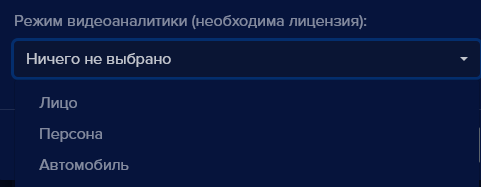

   </td>
   <td><strong> </strong>кнопка выхода из учетной записи пользователя.
   </td>
  </tr>
</table>

 	В левой части экрана расположены кнопки и вкладки:

<table>
  <tr>
   <td>

>>>>>  gd2md-html alert: inline image link here (to images/image34.png). Store image on your image server and adjust path/filename/extension if necessary.  (<a href="#">Back to top</a>)(<a href="#gdcalert36">Next alert</a>) >>>>> 

   </td>
   <td>на вкладке <strong>Настройки </strong>указываются параметры видеопотока и настройки дополнительных возможностей для данного устройства
   </td>
  </tr>
  <tr>
   <td>

>>>>>  gd2md-html alert: inline image link here (to images/image35.png). Store image on your image server and adjust path/filename/extension if necessary.  (<a href="#">Back to top</a>)(<a href="#gdcalert37">Next alert</a>) >>>>> 

   </td>
   <td>на вкладке <strong>Учетные записи </strong>администратором<strong> </strong>создается база учетных записей пользователей <strong>eVision</strong>
   </td>
  </tr>
  <tr>
   <td>

>>>>>  gd2md-html alert: inline image link here (to images/image36.png). Store image on your image server and adjust path/filename/extension if necessary.  (<a href="#">Back to top</a>)(<a href="#gdcalert38">Next alert</a>) >>>>> 

   </td>
   <td>на вкладке <strong>Пользователи </strong>создается база сотрудников с фотографиями и настраивается доступ для подключенных устройств
   </td>
  </tr>
  <tr>
   <td>

>>>>>  gd2md-html alert: inline image link here (to images/image37.png). Store image on your image server and adjust path/filename/extension if necessary.  (<a href="#">Back to top</a>)(<a href="#gdcalert39">Next alert</a>) >>>>> 

   </td>
   <td>на вкладке <strong>История </strong>содержится база распознанных объектов, лиц, автомобилей, и автомобильных номеров. Доступны действия по выбору источника, фильтры, экспорт данных.
   </td>
  </tr>
  <tr>
   <td>

>>>>>  gd2md-html alert: inline image link here (to images/image38.png). Store image on your image server and adjust path/filename/extension if necessary.  (<a href="#">Back to top</a>)(<a href="#gdcalert40">Next alert</a>) >>>>> 

   </td>
   <td>на вкладке <strong>Номера </strong>создается база автомобильных номеров и настраивается доступ автомобилей для подключенных устройств
   </td>
  </tr>
  <tr>
   <td>

>>>>>  gd2md-html alert: inline image link here (to images/image39.png). Store image on your image server and adjust path/filename/extension if necessary.  (<a href="#">Back to top</a>)(<a href="#gdcalert41">Next alert</a>) >>>>> 

   </td>
   <td>вкладка <strong>Отчеты </strong>позволяет просматривать статистику по распознанным объектам
   </td>
  </tr>
  <tr>
   <td>

>>>>>  gd2md-html alert: inline image link here (to images/image40.png). Store image on your image server and adjust path/filename/extension if necessary.  (<a href="#">Back to top</a>)(<a href="#gdcalert42">Next alert</a>) >>>>> 

   </td>
   <td>на вкладке <strong>Видеоархив </strong>можно просматривать записи с видеоустройств,
   </td>
  </tr>
  <tr>
   <td>

>>>>>  gd2md-html alert: inline image link here (to images/image41.png). Store image on your image server and adjust path/filename/extension if necessary.  (<a href="#">Back to top</a>)(<a href="#gdcalert43">Next alert</a>) >>>>> 

   </td>
   <td>кнопка для перезапуска <strong>eVision</strong>.
   </td>
  </tr>
</table>

В нижней части экрана находится:

<table>
  <tr>
   <td>

>>>>>  gd2md-html alert: inline image link here (to images/image42.png). Store image on your image server and adjust path/filename/extension if necessary.  (<a href="#">Back to top</a>)(<a href="#gdcalert44">Next alert</a>) >>>>> 

   </td>
   <td>виджет <strong>Открытые линии</strong>  для связи с технической поддержкой,
   </td>
  </tr>
  <tr>
   <td>

>>>>>  gd2md-html alert: inline image link here (to images/image43.png). Store image on your image server and adjust path/filename/extension if necessary.  (<a href="#">Back to top</a>)(<a href="#gdcalert45">Next alert</a>) >>>>> 

   </td>
   <td>кнопка для сворачивания панели вкладок.
   </td>
  </tr>
</table>

10.
**Добавление устройств**
Для добавления нового видеоустройства необходимо иметь следующую информацию: IP адрес устройства, логин и пароль для подключения. IP-адрес, логин и пароль можно получить у администратора вашей сети или в документации к устройству.

*   Для того, чтобы добавить новое видеоустройство, нажмите кнопку **Добавить устройство **

>>>>>  gd2md-html alert: inline image link here (to images/image44.png). Store image on your image server and adjust path/filename/extension if necessary.  (<a href="#">Back to top</a>)(<a href="#gdcalert46">Next alert</a>) >>>>> 

 на **Панели устройств**. Откроется окно **Добавить устройство**, с выпадающим списком **Устройство**.

Для устройств в данном списке в **eVision** имеются предустановленные параметры для получения видеопотока и работы замка, которые не придется настраивать вручную.

_Для примера будет использован видеодомофон Beward DS06M. _

*   Выберите в списке **Устройство** пункт **Beward (DS06M)**, откроется окно параметров устройства.
*   В поле **Имя устройства **введите наименование нового устройства, для ввода допускаются буквы и цифры. Укажите уникальное имя, означающее назначение или местоположение устройства, например _Вход, Домофон, Камера на въезде,_
*   В поле **IP-адрес устройства **введите корректный IP адрес видеоустройства,
*   В поле **Логин доступа** введите логин для доступа на устройство,
*   В поле **Пароль доступа** введите пароль для доступа на устройство,
*   В поле **Режим видеоаналитики (необходима лицензия)** выберите **Лицо, **если видеоустройство будет использоваться для распознавания лиц людей или **Автомобильные номера,** если видеоустройство предназначено для распознавания автомобильных номеров,
*   Нажмите кнопку **Добавить**, откроется окно, в котором транслируется видео с данного устройства.

>>>>>  gd2md-html alert: inline image link here (to images/image45.png). Store image on your image server and adjust path/filename/extension if necessary.  (<a href="#">Back to top</a>)(<a href="#gdcalert47">Next alert</a>) >>>>> 

При подключении видеодомофонов появляется  кнопка **Открыть замок**

>>>>>  gd2md-html alert: inline image link here (to images/image46.png). Store image on your image server and adjust path/filename/extension if necessary.  (<a href="#">Back to top</a>)(<a href="#gdcalert48">Next alert</a>) >>>>> 

, при нажатии на нее срабатывает контроллер замка. Данная кнопка применяется для открытия двери вручную.

**! **Если в данном списке нет устройства, которое необходимо подключить, выберите пункт “Многоточие”

>>>>>  gd2md-html alert: inline image link here (to images/image47.png). Store image on your image server and adjust path/filename/extension if necessary.  (<a href="#">Back to top</a>)(<a href="#gdcalert49">Next alert</a>) >>>>> 

.

11.
**Сканер устройств**
Для автоматического поиска устройств в локальной сети используйте встроенный способ. Сканер устройств работает по протоколу UPnP. В некоторых случаях это помогает сократить время на поиск нужного устройства. Однако следует учесть, что данный функционал может зависеть от настроек локальной сети, а также могут быть некоторые ограничения использования данного функционала на Windows. Веб-камера сканером устройств не определяется.

Для того, чтобы запустить поиск устройств в локальной сети по протоколу UPNP:

*   нажмите кнопку

>>>>>  gd2md-html alert: inline image link here (to images/image48.png). Store image on your image server and adjust path/filename/extension if necessary.  (<a href="#">Back to top</a>)(<a href="#gdcalert50">Next alert</a>) >>>>> 

 **Сканер устройств **на панели устройств. Откроется окно сканера устройств.

>>>>>  gd2md-html alert: inline image link here (to images/image49.png). Store image on your image server and adjust path/filename/extension if necessary.  (<a href="#">Back to top</a>)(<a href="#gdcalert51">Next alert</a>) >>>>> 

*   Нажмите кнопку **Сканировать**

Откроется окно результатов сканирования. В случае, если видеоустройства в сети не обнаружены, то окно выглядит так:

>>>>>  gd2md-html alert: inline image link here (to images/image50.png). Store image on your image server and adjust path/filename/extension if necessary.  (<a href="#">Back to top</a>)(<a href="#gdcalert52">Next alert</a>) >>>>> 

В случае если видеоустройств в сети найдены, то окно будет выглядеть так:

>>>>>  gd2md-html alert: inline image link here (to images/image51.png). Store image on your image server and adjust path/filename/extension if necessary.  (<a href="#">Back to top</a>)(<a href="#gdcalert53">Next alert</a>) >>>>> 

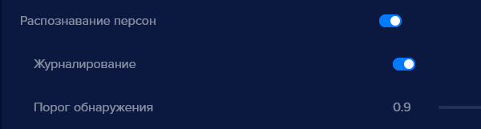

*   В выпадающем списке выберите нужное устройство. Наименование устройства зависит от настроек самого устройства, в вашей сети устройства могут быть названы иначе.

>>>>>  gd2md-html alert: inline image link here (to images/image52.png). Store image on your image server and adjust path/filename/extension if necessary.  (<a href="#">Back to top</a>)(<a href="#gdcalert54">Next alert</a>) >>>>> 

*   Выберите устройство, откроется окно настроек:

>>>>>  gd2md-html alert: inline image link here (to images/image53.png). Store image on your image server and adjust path/filename/extension if necessary.  (<a href="#">Back to top</a>)(<a href="#gdcalert55">Next alert</a>) >>>>> 

*   Выберите модель устройства из выпадающего списка, если данное устройство присутствует в списке. Если вашего устройства в списке нет, выберите пункт “многоточие”

>>>>>  gd2md-html alert: inline image link here (to images/image54.png). Store image on your image server and adjust path/filename/extension if necessary.  (<a href="#">Back to top</a>)(<a href="#gdcalert56">Next alert</a>) >>>>> 

.
*   Введите имя устройства, оно должно быть уникальным. Автоматически имя устройства берется из результатов сканера устройства.
*   Поле **IP-адрес** заполнено автоматически
*   В поле **Логин доступа** введите логин для доступа на устройство.
*   В поле **Пароль доступа** введите пароль для доступа на устройство.
*   В поле **Режим видеоаналитики (необходима лицензия)** выберите **Лицо, **если видеоустройство будет использоваться для распознавания лиц людей, или выберите **Автомобильные номера,** если видеоустройство предназначено для распознавания автомобильных номеров, или **Автомобиль**.Также можно задать несколько типов детекторов одновременно.
*   Нажмите кнопку **Добавить**, откроется окно, в котором транслируется видео с данного устройства.

12.
**Перезагрузить устройство**
Для того, чтобы перезагрузить трансляцию с видеоустройства:

*   Нажмите кнопку **Перезагрузить устройство **

>>>>>  gd2md-html alert: inline image link here (to images/image55.png). Store image on your image server and adjust path/filename/extension if necessary.  (<a href="#">Back to top</a>)(<a href="#gdcalert57">Next alert</a>) >>>>> 

, откроется окно подтверждения перезагрузки устройства.

>>>>>  gd2md-html alert: inline image link here (to images/image56.png). Store image on your image server and adjust path/filename/extension if necessary.  (<a href="#">Back to top</a>)(<a href="#gdcalert58">Next alert</a>) >>>>> 

*   Нажмите на кнопку **ОК, **трансляция перезапустится и откроется окно в котором  транслируется видео с данного устройства.

**! **При перезапуске трансляции само устройство не перезагружается.

13.
**Удалить устройство**
Для того, чтобы удалить устройство:

<table>
  <tr>
   <td>
<ul>

<li>Нажмите кнопку с номером нужного устройства
</li>
</ul>
   </td>
   <td>

>>>>>  gd2md-html alert: inline image link here (to images/image57.png). Store image on your image server and adjust path/filename/extension if necessary.  (<a href="#">Back to top</a>)(<a href="#gdcalert59">Next alert</a>) >>>>> 

   </td>
  </tr>
  <tr>
   <td>
<ul>

<li>Нажмите кнопку <strong>Удалить устройство </strong>

>>>>>  gd2md-html alert: inline image link here (to images/image58.png). Store image on your image server and adjust path/filename/extension if necessary.  (<a href="#">Back to top</a>)(<a href="#gdcalert60">Next alert</a>) >>>>> 

, откроется окно подтверждения удаления устройства.
</li>
</ul>
   </td>
   <td>

>>>>>  gd2md-html alert: inline image link here (to images/image59.png). Store image on your image server and adjust path/filename/extension if necessary.  (<a href="#">Back to top</a>)(<a href="#gdcalert61">Next alert</a>) >>>>> 

   </td>
  </tr>
</table>

*   Выберите **Удалить**, устройство будет удалено из **eVision**

**! **При удалении устройства события в истории сохраняются.

14.
Настройки
Данный раздел предназначен для ввода лицензионного ключа, настройки параметров видеопотока, настройки видеоаналитики, управления замком, настройки видеоархива, настройки голосовыми уведомлениями и оповещениями, а также для  активации облачного сервиса для устройства.

В настройках содержатся разделы:

*   Лицензия
*   Камера
*   Видеоархив
*   События
*   Голосовой сервис
*   Видеоаналитика
*   Подключение к** eVision Cloud**

    9.
Лицензия
Раздел **Лицензия** необходим для ввода лицензионного ключа. Лицензионный ключ прописывается для каждого устройства. По-умолчанию в **eVision** доступна встроенная лицензия на одно устройство, cм. п.

>>>>>  gd2md-html alert: undefined internal link (link text: "5.7"). Did you generate a TOC?  (<a href="#">Back to top</a>)(<a href="#gdcalert62">Next alert</a>) >>>>> 

[5.7](#heading=h.ldn365668bn8).

>>>>>  gd2md-html alert: inline image link here (to images/image60.png). Store image on your image server and adjust path/filename/extension if necessary.  (<a href="#">Back to top</a>)(<a href="#gdcalert63">Next alert</a>) >>>>> 

    10.
Камера
Раздел **Камера **содержит настройки видеопотока, разрешения, частоты кадров, сервиса получения снимков по FTP и детектора движения.

>>>>>  gd2md-html alert: inline image link here (to images/image61.png). Store image on your image server and adjust path/filename/extension if necessary.  (<a href="#">Back to top</a>)(<a href="#gdcalert64">Next alert</a>) >>>>> 

Кнопка** Активация** позволяет выключить или включить получение видеопотока с устройства для видеоаналитики.

В поле** Название** указывается наименование устройства.

В поле** Сетевой адрес **указывается путь для получения видеопотока.

В пункте** Разрешение **указывается разрешение, с которым **eVision** получает видеопоток с устройства. Доступные значения: **Original, 320x240, 640x480, 1280x720**. При выборе значения **Original,** **eVision** получает видеопоток с разрешением, указанным в настройках самого устройства.

В пункте **Частота кадров **указывается максимальная частота кадров видеопотока. Доступные значения: от 1 до 25 кадров в секунду. Регулировка выполняется ползунком по шкале.

В пункте **Протокол **выбор транспортного протокола доступны варианты: TCP и UDP.

В блоке **Детекция движения **находится кнопка **Включить **для включения детектора движения.

В пункте **Чувствительность **указывается уровень чувствительности детектора движения. Доступные значения: **Максимальная, Высокая, Средняя, Низкая, Минимальная**.

    11.
Видеоархив
В разделе **Видеоархив **включается и настраивается путь к видеопотоку, который будет сохраняться на жестком диске. Время хранения видеопотока указывается в общих настройках см. пункт

>>>>>  gd2md-html alert: undefined internal link (link text: "Настройки времени хранения"). Did you generate a TOC?  (<a href="#">Back to top</a>)(<a href="#gdcalert65">Next alert</a>) >>>>> 

[Настройки времени хранения](#heading=h.1cw86856xg20).

>>>>>  gd2md-html alert: inline image link here (to images/image62.png). Store image on your image server and adjust path/filename/extension if necessary.  (<a href="#">Back to top</a>)(<a href="#gdcalert66">Next alert</a>) >>>>> 

Кнопка Включить запись видео - включает запись видеофайлов на жесткий диск.

В поле Сетевой адрес указывается путь для получения видеопотока.

    12.
События
В разделе **События **содержатся настройки замками, сетевыми реле и запросами webhook.

Содержит несколько предустановленных вариантов оборудования различных производителей, включая сетевые реле и видеоустройства с релейными выходами. А также работу сетевого реле можно настроить вручную, используя распространенные параметры.

>>>>>  gd2md-html alert: inline image link here (to images/image63.png). Store image on your image server and adjust path/filename/extension if necessary.  (<a href="#">Back to top</a>)(<a href="#gdcalert67">Next alert</a>) >>>>> 

В пункте **Интервал событий (сек) **- указывается интервал времени срабатывания замка.

**Тип устройства **содержит список устройств, для которых в **eVision** сохранены параметры для управления реле различных производителей. Либо для настройки замка вручную.

**Открывать при распознавании **- пункт, который отвечает за срабатывание замка, при распознавании человека с разрешенным доступом.

**Сетевой адрес** - IP адрес устройства

**Логин** - учетная запись для доступа на устройство

**Пароль** - пароль учетной записи для доступа на устройство

**Токен** - ключ для подключения к реле, используется на некоторых устройствах

**Канал **- порядковый номер выхода, используется на некоторых сетевых реле

После заполнения полей, в окне видеопотока появится кнопка **Открыть замок **

>>>>>  gd2md-html alert: inline image link here (to images/image64.png). Store image on your image server and adjust path/filename/extension if necessary.  (<a href="#">Back to top</a>)(<a href="#gdcalert68">Next alert</a>) >>>>> 

.

**Webhook**

Раздел для настройки http запросов, которые могут отправляться на указанный адрес сервера при распознавании объекта.

>>>>>  gd2md-html alert: inline image link here (to images/image65.png). Store image on your image server and adjust path/filename/extension if necessary.  (<a href="#">Back to top</a>)(<a href="#gdcalert69">Next alert</a>) >>>>> 

Кнопка **Включить **- для включения сервиса отправки webhook запросов.

Поле **Webhook URI **- поле для ввода адреса сервера для приема webhook запросов

Пункт **Тип запроса **- список для выбора типа запроса, **POST** или **GET**

**Отправить: Идентификатор объекта, Имя объекта, Идентификатор устройства, Имя устройства, Доступ пользователя **- включает или убирает из запроса выбранную информацию.

        1.
График работы управления доступом
Служит для настройки рабочего времени устройства.

>>>>>  gd2md-html alert: inline image link here (to images/image66.png). Store image on your image server and adjust path/filename/extension if necessary.  (<a href="#">Back to top</a>)(<a href="#gdcalert70">Next alert</a>) >>>>> 

**Рабочее время** - указывает диапазон времени для работы видеоаналитики на устройстве.

**Отключать на выходные **- пункт для включения субботы и воскресенья в рабочие дни недели.

    13.
Голосовой сервис
Раздел, в котором настраиваются уведомления по SIP на устройство и голосовые оповещения для оператора.

        2.
Настройка SIP уведомлений
Служит для настройки запросов по протоколу SIP на устройство, поддерживающее подключение по SIP с динамиком. Это может быть видеодомофон, который принимает вызовы по SIP в локальной сети или SIP громкоговоритель.

>>>>>  gd2md-html alert: inline image link here (to images/image67.png). Store image on your image server and adjust path/filename/extension if necessary.  (<a href="#">Back to top</a>)(<a href="#gdcalert71">Next alert</a>) >>>>> 

Кнопка **Включить** - включает или отключает подключение к устройству по протоколу SIP.

Поле **SIP URI** - для ввода SIP запроса, как правило включает в себя имя sip аккаунта и IP адрес устройства (пример: _sip:100@172.17.2.100_).

**Час начала ночи** - переключатель для выбора времени для начала ночи

**Приветствие для ночи** - текст уведомления, которое произносится устройством при распознавании человека ночью

**Час начала утра** - переключатель для выбора времени для начала утра

**Приветствие для утра **- текст уведомления, которое произносится устройством при распознавании человека утром

**Час начала дня** - переключатель для выбора времени для начала дня

**Приветствие для дня** - текст уведомления, которое произносится устройством при распознавании человека днем

**Час начала вечера **- переключатель для выбора времени для начала вечера

**Приветствие для вечера** - текст уведомления, которое произносится устройством при распознавании человека вечером

**Фраза для лиц с доступом** - текст уведомления, которое произносится устройством при распознавании человека, со разрешенным доступом

**Фраза для лиц без доступа** - текст уведомления, которое произносится устройством при распознавании человека, с запрещенным доступом

**Приветствие нераспоз. лиц **- текст уведомления, которое произносится устройством при распознавании человека, которого нет в базе пользователей.

        3.
Оповещения оператора
В данном разделе настраиваются голосовые оповещения, которые работают в интерфейсе **eVision**.** **Существуют** **два вида оповещения: при появлении движения в кадре и при распознавании пользователя. Как включить оповещения:

>>>>>  gd2md-html alert: undefined internal link (link text: "можно посмотреть в инструкции по этой ссылке"). Did you generate a TOC?  (<a href="#">Back to top</a>)(<a href="#gdcalert72">Next alert</a>) >>>>> 

[можно посмотреть в инструкции по этой ссылке](#heading=h.y1uex075oqa5)

>>>>>  gd2md-html alert: inline image link here (to images/image68.png). Store image on your image server and adjust path/filename/extension if necessary.  (<a href="#">Back to top</a>)(<a href="#gdcalert73">Next alert</a>) >>>>> 

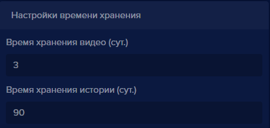

**Детектор движения**

В блоке **Детектор движения **содержатся:

Кнопка **Включить** - позволяет включить или отключить оповещения при срабатывании детектора движения.

Список **Тип оповещений **- позволяет выбрать тип оповещений. Доступны варианты: **Фраза, Звук,  Файл пользователя.**

При выборе **Фраза **будет проигрываться стандартная фраза (“На камере замечено движение”).

>>>>>  gd2md-html alert: inline image link here (to images/image69.png). Store image on your image server and adjust path/filename/extension if necessary.  (<a href="#">Back to top</a>)(<a href="#gdcalert74">Next alert</a>) >>>>> 

	При выборе пункта **Звук **будет воспроизведен стандартный звуковой сигнал.

При выборе пункта **Файл **появляется дополнительное поле **Выберите файл** для загрузки аудиофайла с жесткого диска. Если не загружать файл с жесткого диска, то будет проигрываться стандартный звуковой сигнал.

**Детектор объектов**

В блоке **Детектор объектов **содержатся:

Кнопка **Включить** - позволяет включить или отключить оповещения при срабатывании детектора объектов, то есть при распознавании пользователя.

>>>>>  gd2md-html alert: inline image link here (to images/image70.png). Store image on your image server and adjust path/filename/extension if necessary.  (<a href="#">Back to top</a>)(<a href="#gdcalert75">Next alert</a>) >>>>> 

В блоке **Распознанные** находится выбор оповещений, которые будут проигрываться, при распознавании человека, который есть в базе пользователей.

Список **Режим оповещения** позволяет выбрать тип оповещений. Доступны варианты: **Фраза**, **Файл пользователя, Звук**. При выборе **Фраза **будет проигрываться стандартная фраза (“На камере замечен распознанный объект”). При выборе пункта **Файл **появляется дополнительное поле **Выберите файл** для загрузки аудиофайла с жесткого диска. Если не загружать файл с жесткого диска, то будет проигрываться стандартный звуковой сигнал. При выборе **Звук **будет воспроизведен стандартный сигнал.

В блоке **Нераспознанные** находится выбор оповещений, которые будут проигрываться, при распознавании человека, которого нет в базе персон.

Список **Режим оповещения** позволяет выбрать тип оповещений. Доступны варианты: **Фраза** или **Файл**. При выборе **Фраза **будет проигрываться стандартная фраза (“На камере замечен не распознанный объект”). При выборе пункта **Файл **появляется дополнительное поле **Выберите файл** для загрузки аудиофайла с жесткого диска. Если не загружать файл или выбран пункт **Звук** с жесткого диска, то будет проигрываться стандартный звуковой сигнал.

    14.
Видеоаналитика
Раздел **Видеоаналитика **отвечает за настройки распознавания объектов. В данном разделе выбирается режим видеоаналитики устройства. В данный момент доступны четыре режима видеоаналитики: **Распознавание лиц, Распознавание пользователей, Распознавание автотранспорта, Распознавание автомобильных номеров **. Режим может быть выбран при добавлении нового устройства в **eVision**.

У каждого типа распознавания есть отдельный переключатель позволяющий управлять включение или отключением данного типа распознавания

>>>>>  gd2md-html alert: inline image link here (to images/image71.png). Store image on your image server and adjust path/filename/extension if necessary.  (<a href="#">Back to top</a>)(<a href="#gdcalert76">Next alert</a>) >>>>> 

>>>>>  gd2md-html alert: inline image link here (to images/image72.png). Store image on your image server and adjust path/filename/extension if necessary.  (<a href="#">Back to top</a>)(<a href="#gdcalert77">Next alert</a>) >>>>> 

        4.
Распознавание лиц

>>>>>  gd2md-html alert: inline image link here (to images/image73.png). Store image on your image server and adjust path/filename/extension if necessary.  (<a href="#">Back to top</a>)(<a href="#gdcalert78">Next alert</a>) >>>>> 

    В блоке **Распознавание лиц** находятся элементы управления позволяющие настроить основные параметры идентификации:

    кнопка включения - позволяет включить или отключить режим распознавания лиц.

    **Идентификация лица **- активирует процедуру идентификации пользователя с последующей верификацией и записью в Истории.

    **Определение возраста **- система попытается определить возраст человека,  чье лицо находится в кадре.

    **Определение пола **- алгоритм распознавания попытается определить пол пользователя.

>>>>>  gd2md-html alert: inline image link here (to images/image74.png). Store image on your image server and adjust path/filename/extension if necessary.  (<a href="#">Back to top</a>)(<a href="#gdcalert79">Next alert</a>) >>>>> 

    **Использовать историю **- при включении алгоритм будет использовать также и распознанные лица пользователя из истории, что повышает точность распознавания.

    **Журналирование **- параметр отвечает за сохранение распознавания в истории, если отключен то в истории не будут сохранены распознанные объекты.

    Раздел **Дополнительные настройки**:

    **Упрощенный детектор **- включает упрощенный алгоритм распознавания лиц для снижения нагрузки на процессор

    **Фронтальный детектор** - если детектор включен, лица расположенные к камере боком распознаваться не будут

    **Минимальный размер лица (%) ** - позволяет выбрать минимальный размер лица при распознавании. В данном случае определяется ширина лица человека, относительно ширины кадра. Изменяется от 5 до 85 %. По-умолчанию выбрано значение 10%

    **Порог обнаружения **-  статистическая мера вероятности того, что два лица на изображении принадлежат одному и тому же человеку, при анализе, чем ниже порог тем больше шанс обнаружения.

    **Автодобавление не распознанных лиц **- внесение всех распознанных лиц в базу пользователей. Если алгоритм распознает лицо, оно будет добавлено в таблицу пользователей.

        5.
Распознавание персон

>>>>>  gd2md-html alert: inline image link here (to images/image75.png). Store image on your image server and adjust path/filename/extension if necessary.  (<a href="#">Back to top</a>)(<a href="#gdcalert80">Next alert</a>) >>>>> 

В блоке **Распознавание персон** доступны следующие настройки.

**Журналирование **- позволяет включить или отключить сохранение истории

распознаваний силуэтов.

**Порог обнаружения **- позволяет выбрать минимальный порог для распознавания

персоны. Изменяется от -1 до 1. По умолчанию выбрано значение - 0.9

        6.
Распознавание автотранспорта

>>>>>  gd2md-html alert: inline image link here (to images/image76.png). Store image on your image server and adjust path/filename/extension if necessary.  (<a href="#">Back to top</a>)(<a href="#gdcalert81">Next alert</a>) >>>>> 

Блок **Распознавание автотранспорта, **переключатель активирует, так же доступны настройки:

**Распознавание автомобильных номеров **- включает отдельный детектор отвечающий за распознавание номеров автомобилей.

**Журналирование** - распознанные автомобили, и номера сохраняются в историю.

**Порог обнаружения **- позволяет установить минимальный порог для распознавания автотранспорта изменяется от -1 до 1. По умолчанию равен 0.9

    15.
Подключение к eVision Cloud
В данном разделе включается или отключается подключение устройства к сервису **eVision.Cloud**.

>>>>>  gd2md-html alert: inline image link here (to images/image77.png). Store image on your image server and adjust path/filename/extension if necessary.  (<a href="#">Back to top</a>)(<a href="#gdcalert82">Next alert</a>) >>>>> 

При включении **Активировать **- включается возможность транслировать видео с данного устройства в сервис **eVision.Cloud**.

Кнопка **Зарегистрировать устройство **- открывает браузер с страницей регистрации устройства в панели Trusted.ID.

>>>>>  gd2md-html alert: inline image link here (to images/image78.png). Store image on your image server and adjust path/filename/extension if necessary.  (<a href="#">Back to top</a>)(<a href="#gdcalert83">Next alert</a>) >>>>> 

Кнопка **Восстановить настройки по умолчанию **- восстанавливает значения полей по умолчанию.

Кнопка **Сохранить  **применяет все изменения настроек устройства.

Кнопка **Отменить ** отменяет сделанные в интерфейсе изменения.

В случае если пользователь внес изменения в настройки но не сохранил результат, при переходе в другую часть программы появится окно с запросом сохранения внесенных изменений.

###

>>>>>  gd2md-html alert: inline image link here (to images/image79.png). Store image on your image server and adjust path/filename/extension if necessary.  (<a href="#">Back to top</a>)(<a href="#gdcalert84">Next alert</a>) >>>>> 

15.
Учетные записи.
Данный раздел предназначен для создания и редактирования учетных записей пользователей **eVision**. Для учетной записи указывается его роль (администратор или оператор):

**Администратор** обладает полным функционалом, включая просмотр видеопотока с устройств, создание и удаление устройств, пользователей, номеров, учетных записей и изменение общих настроек **eVision**.

 **Оператор** может только просматривать видеопоток, список пользователей, номеров, групп. По умолчанию создана учетная запись с ролью Администратор - **admin. **

Для учетных записей доступны следующие операции:

*   Добавление и выбор роли пользователя.
*   Редактирование роли пользователя.
*   Удаление пользователя.
*   Поиск.
*   Обновление списка пользователей.
*   Экспорт таблицы пользователей в файлы разных форматов.

Права пользователей:

<table>
  <tr>
   <td>Действия
   </td>
   <td>Администратор
   </td>
   <td>Пользователь
   </td>
  </tr>
  <tr>
   <td>Просмотр видеопотока
   </td>
   <td>Да
   </td>
   <td>Да
   </td>
  </tr>
  <tr>
   <td>Просмотр видеоархива
   </td>
   <td>Да
   </td>
   <td>Да
   </td>
  </tr>
  <tr>
   <td>Просмотр пользователей
   </td>
   <td>Да
   </td>
   <td>Да
   </td>
  </tr>
  <tr>
   <td>Просмотр номеров
   </td>
   <td>Да
   </td>
   <td>Да
   </td>
  </tr>
  <tr>
   <td>Просмотр групп
   </td>
   <td>Да
   </td>
   <td>Да
   </td>
  </tr>
  <tr>
   <td>Просмотр истории
   </td>
   <td>Да
   </td>
   <td>Да
   </td>
  </tr>
  <tr>
   <td>Просмотр отчетов
   </td>
   <td>Да
   </td>
   <td>Да
   </td>
  </tr>
  <tr>
   <td>Работа с виджетом открытых линий
   </td>
   <td>Да
   </td>
   <td>Да
   </td>
  </tr>
  <tr>
   <td>Добавление и удаление устройств
   </td>
   <td>Да
   </td>
   <td>Нет
   </td>
  </tr>
  <tr>
   <td>Добавление и удаление пользователей
   </td>
   <td>Да
   </td>
   <td>Нет
   </td>
  </tr>
  <tr>
   <td>Добавление и удаление номеров
   </td>
   <td>Да
   </td>
   <td>Нет
   </td>
  </tr>
  <tr>
   <td>Добавление и удаление групп
   </td>
   <td>Да
   </td>
   <td>Нет
   </td>
  </tr>
  <tr>
   <td>Добавление и удаление учетных записей
   </td>
   <td>Да
   </td>
   <td>Нет
   </td>
  </tr>
  <tr>
   <td>Изменение общих настроек <strong>eVision</strong>
   </td>
   <td>Да
   </td>
   <td>Нет
   </td>
  </tr>
</table>

    16.
Добавление учетной записи
Для того, чтобы добавить учетную запись:

*   Нажмите кнопку **Добавить новую учетную запись **

>>>>>  gd2md-html alert: inline image link here (to images/image80.png). Store image on your image server and adjust path/filename/extension if necessary.  (<a href="#">Back to top</a>)(<a href="#gdcalert85">Next alert</a>) >>>>> 

, откроется окно **Добавить новую учетную запись**:

>>>>>  gd2md-html alert: inline image link here (to images/image81.png). Store image on your image server and adjust path/filename/extension if necessary.  (<a href="#">Back to top</a>)(<a href="#gdcalert86">Next alert</a>) >>>>> 

*   Выберите **Роль (Администратор **или **Оператор)**

>>>>>  gd2md-html alert: inline image link here (to images/image82.png). Store image on your image server and adjust path/filename/extension if necessary.  (<a href="#">Back to top</a>)(<a href="#gdcalert87">Next alert</a>) >>>>> 

*   Введите **Имя учетной записи**

>>>>>  gd2md-html alert: inline image link here (to images/image83.png). Store image on your image server and adjust path/filename/extension if necessary.  (<a href="#">Back to top</a>)(<a href="#gdcalert88">Next alert</a>) >>>>> 

*   Введите **Пароль учетной записи**

>>>>>  gd2md-html alert: inline image link here (to images/image84.png). Store image on your image server and adjust path/filename/extension if necessary.  (<a href="#">Back to top</a>)(<a href="#gdcalert89">Next alert</a>) >>>>> 

Если необходимо проверить введенный пароль:

*   Нажмите кнопку для его отображения

>>>>>  gd2md-html alert: inline image link here (to images/image85.png). Store image on your image server and adjust path/filename/extension if necessary.  (<a href="#">Back to top</a>)(<a href="#gdcalert90">Next alert</a>) >>>>> 

*   Нажмите кнопку **Применить **

>>>>>  gd2md-html alert: inline image link here (to images/image86.png). Store image on your image server and adjust path/filename/extension if necessary.  (<a href="#">Back to top</a>)(<a href="#gdcalert91">Next alert</a>) >>>>> 

Окно **Добавить новую учетную запись **закроется** **и в списке появится новая учетная запись.

>>>>>  gd2md-html alert: inline image link here (to images/image87.png). Store image on your image server and adjust path/filename/extension if necessary.  (<a href="#">Back to top</a>)(<a href="#gdcalert92">Next alert</a>) >>>>> 

    17.
Редактирование учетной записи
Для того, чтобы изменить роль пользователя, имя или пароль:

*   Нажмите кнопку **Редактировать **

>>>>>  gd2md-html alert: inline image link here (to images/image88.png). Store image on your image server and adjust path/filename/extension if necessary.  (<a href="#">Back to top</a>)(<a href="#gdcalert93">Next alert</a>) >>>>> 

, откроется окно **Редактировать учетную запись**:

>>>>>  gd2md-html alert: inline image link here (to images/image89.png). Store image on your image server and adjust path/filename/extension if necessary.  (<a href="#">Back to top</a>)(<a href="#gdcalert94">Next alert</a>) >>>>> 

*   При необходимости, измените роль, имя учетной записи или пароль

>>>>>  gd2md-html alert: inline image link here (to images/image90.png). Store image on your image server and adjust path/filename/extension if necessary.  (<a href="#">Back to top</a>)(<a href="#gdcalert95">Next alert</a>) >>>>> 

*   Нажмите кнопку **Применить **

>>>>>  gd2md-html alert: inline image link here (to images/image91.png). Store image on your image server and adjust path/filename/extension if necessary.  (<a href="#">Back to top</a>)(<a href="#gdcalert96">Next alert</a>) >>>>> 

Окно редактирования закроется и в списке записей отобразятся сделанные изменения.

>>>>>  gd2md-html alert: inline image link here (to images/image92.png). Store image on your image server and adjust path/filename/extension if necessary.  (<a href="#">Back to top</a>)(<a href="#gdcalert97">Next alert</a>) >>>>> 

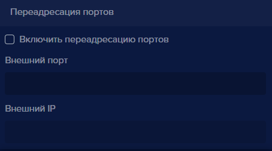

    18.
Удаление учетной записи
Для того, чтобы удалить пользователя:

*   Нажмите кнопку **Удалить учетную запись**

>>>>>  gd2md-html alert: inline image link here (to images/image93.png). Store image on your image server and adjust path/filename/extension if necessary.  (<a href="#">Back to top</a>)(<a href="#gdcalert98">Next alert</a>) >>>>> 

, откроется окно подтверждения удаления:

>>>>>  gd2md-html alert: inline image link here (to images/image94.png). Store image on your image server and adjust path/filename/extension if necessary.  (<a href="#">Back to top</a>)(<a href="#gdcalert99">Next alert</a>) >>>>> 

*   Нажмите кнопку **Удалить  **

>>>>>  gd2md-html alert: inline image link here (to images/image95.png). Store image on your image server and adjust path/filename/extension if necessary.  (<a href="#">Back to top</a>)(<a href="#gdcalert100">Next alert</a>) >>>>> 

Окно подтверждения закроется, учетная запись удаляется из списка номеров.

**!** Обратите внимание, что если остается последний пользователь с ролью Администратор, удалить его невозможно.

16.
Пользователи
На вкладке **Пользователи** создается база данных пользователей, с фотографиями для распознавания, заполняются имена и фамилии, принадлежность группе пользователей, указывается идентификатор сотрудника. Для каждого человека настраивается доступ на устройства, добавленные в **eVision**, тем самым разрешается  или запрещается человеку проходить в то или иное помещение или территорию. У каждого пользователя есть возможность указывать принадлежность к какой либо созданной группе, к примеру это могут быть наименования отделов (бухгалтерия, разработка). Пользователей можно вносить в базу вручную по одному или несколько в виде zip-архива. Допускается использование фотографий форматов jpeg, jpg, png. Минимальное разрешение фотографии должно быть 300 на 300 пикселей, максимальное следует использовать до 4000 на 4000 пикселей. Используйте фотографии весом не более 2 мегабайт. На фотографии должен быть изображен один человек, анфас. При загрузке фотографии **eVision** вычисляет дескриптор объекта. Лучше сделать фото для добавления в базу пользователей без улыбки, а также следует воздержаться от эмоций, так как при вычислении дескриптор получится некорректным. Каждому пользователю для более точного распознавания можно добавить несколько фото. Очки и борода не являются препятствием для вычисления дескриптора. Добавлять людей можно в ручную, на вкладке **Пользователи**, а также при распознавании. На вкладке **История**, при включенной видеоаналитике можно выбирать фото и добавлять. Возможность наполнения базы пользователей автоматически, при распознавании лиц описана в п.  см. пункт

>>>>>  gd2md-html alert: undefined internal link (link text: "Как включить авто добавление пользователей"). Did you generate a TOC?  (<a href="#">Back to top</a>)(<a href="#gdcalert101">Next alert</a>) >>>>> 

[Как включить авто добавление пользователей](#heading=h.xgubcbxe6t70))

    19.
Добавление пользователя
Для того, чтобы добавить человека:

*   перейдите на вкладку **Пользователи**,
*   Нажмите кнопку **Добавить нового пользователя**

>>>>>  gd2md-html alert: inline image link here (to images/image96.png). Store image on your image server and adjust path/filename/extension if necessary.  (<a href="#">Back to top</a>)(<a href="#gdcalert102">Next alert</a>) >>>>> 

, откроется окно **Добавление новых пользователей**:

>>>>>  gd2md-html alert: inline image link here (to images/image97.png). Store image on your image server and adjust path/filename/extension if necessary.  (<a href="#">Back to top</a>)(<a href="#gdcalert103">Next alert</a>) >>>>> 

*   Выберите вкладку **Один пользователь, **

>>>>>  gd2md-html alert: inline image link here (to images/image98.png). Store image on your image server and adjust path/filename/extension if necessary.  (<a href="#">Back to top</a>)(<a href="#gdcalert104">Next alert</a>) >>>>> 

*   Введите имя и фамилию человека, которого планируете добавить в поле **Имя и фамилия,**
*   Для того, чтобы добавить фото пользователя, кликните указателем мыши в поле **Фотография,**

>>>>>  gd2md-html alert: inline image link here (to images/image99.png). Store image on your image server and adjust path/filename/extension if necessary.  (<a href="#">Back to top</a>)(<a href="#gdcalert105">Next alert</a>) >>>>> 

Откроется окно для выбора и загрузки фотографии.

*   Выберите фото на компьютере и загрузите его в **eVision**. Наименование выбранного фото появится в поле **Фотография**:

>>>>>  gd2md-html alert: inline image link here (to images/image100.png). Store image on your image server and adjust path/filename/extension if necessary.  (<a href="#">Back to top</a>)(<a href="#gdcalert106">Next alert</a>) >>>>> 

*   В поле **Идентификационный номер** введите уникальный идентификатор сотрудника, эти данные нужны для отчета по пользователям.

**! **Можно использовать любые уникальные, не повторяющиеся идентификаторы. Если у вас есть система учета сотрудников, то можно использовать эти идентификаторы.

>>>>>  gd2md-html alert: inline image link here (to images/image101.png). Store image on your image server and adjust path/filename/extension if necessary.  (<a href="#">Back to top</a>)(<a href="#gdcalert107">Next alert</a>) >>>>> 

*   В поле **Группа **выберите, принадлежность сотрудника к группе пользователей.

>>>>>  gd2md-html alert: inline image link here (to images/image102.png). Store image on your image server and adjust path/filename/extension if necessary.  (<a href="#">Back to top</a>)(<a href="#gdcalert108">Next alert</a>) >>>>> 

*   В поле **Доступ разрешен для **выберите и отметьте устройство(ва), для которых данному пользователю необходимо разрешить доступ.

>>>>>  gd2md-html alert: inline image link here (to images/image103.png). Store image on your image server and adjust path/filename/extension if necessary.  (<a href="#">Back to top</a>)(<a href="#gdcalert109">Next alert</a>) >>>>> 

*   Чтобы скрыть список с устройствами, необходимо кликнуть мышью в свободном месте
*   Нажмите кнопку **Применить **

>>>>>  gd2md-html alert: inline image link here (to images/image104.png). Store image on your image server and adjust path/filename/extension if necessary.  (<a href="#">Back to top</a>)(<a href="#gdcalert110">Next alert</a>) >>>>> 

Окно добавления закроется и в списке пользователей появится новый сотрудник.

>>>>>  gd2md-html alert: inline image link here (to images/image105.png). Store image on your image server and adjust path/filename/extension if necessary.  (<a href="#">Back to top</a>)(<a href="#gdcalert111">Next alert</a>) >>>>> 

    20.
Добавление множества пользователей
Добавить несколько пользователей с фотографиями возможно если упаковать фотографии в один zip архив. Подготовьте фотографии сотрудников, в архиве одному сотруднику должно соответствовать одно фото. Фотографии не должны повторяться. Файлы в архиве должны называться согласно именам и фамилиям пользователей, т.к. при добавлении пользователей в **eVision** из архива имена сотрудникам будут даны соответственно названиям фотографий.

*   Нажмите кнопку **Добавить нового пользователя**

>>>>>  gd2md-html alert: inline image link here (to images/image106.png). Store image on your image server and adjust path/filename/extension if necessary.  (<a href="#">Back to top</a>)(<a href="#gdcalert112">Next alert</a>) >>>>> 

, откроется окно **Добавление новых пользователей**. Выберите переключатель **Множество пользователей.**

>>>>>  gd2md-html alert: inline image link here (to images/image107.png). Store image on your image server and adjust path/filename/extension if necessary.  (<a href="#">Back to top</a>)(<a href="#gdcalert113">Next alert</a>) >>>>> 

Кликните в поле **Выберите архив:**

>>>>>  gd2md-html alert: inline image link here (to images/image108.png). Store image on your image server and adjust path/filename/extension if necessary.  (<a href="#">Back to top</a>)(<a href="#gdcalert114">Next alert</a>) >>>>> 

Откроется окно для открытия файлов.

>>>>>  gd2md-html alert: inline image link here (to images/image109.png). Store image on your image server and adjust path/filename/extension if necessary.  (<a href="#">Back to top</a>)(<a href="#gdcalert115">Next alert</a>) >>>>> 

 Выберите zip-архив, нажмите кнопку **Открыть**. Имя zip-архива появится в строке ZIP-архив.

>>>>>  gd2md-html alert: inline image link here (to images/image110.png). Store image on your image server and adjust path/filename/extension if necessary.  (<a href="#">Back to top</a>)(<a href="#gdcalert116">Next alert</a>) >>>>> 

В окне добавления пользователей нажмите кнопку **Применить**

>>>>>  gd2md-html alert: inline image link here (to images/image111.png). Store image on your image server and adjust path/filename/extension if necessary.  (<a href="#">Back to top</a>)(<a href="#gdcalert117">Next alert</a>) >>>>> 

После загрузки zip-архива в **eVision** появится уведомление:

>>>>>  gd2md-html alert: inline image link here (to images/image112.png). Store image on your image server and adjust path/filename/extension if necessary.  (<a href="#">Back to top</a>)(<a href="#gdcalert118">Next alert</a>) >>>>> 

После ожидания появится уведомление с указанием количества успешно добавленных пользователей.

>>>>>  gd2md-html alert: inline image link here (to images/image113.png). Store image on your image server and adjust path/filename/extension if necessary.  (<a href="#">Back to top</a>)(<a href="#gdcalert119">Next alert</a>) >>>>> 

Нажмите кнопку **Закрыть**.

В списке пользователей будут отображены, добавленные из архива пользователи.

    21.
Редактирование пользователя
Для того, чтобы изменить имя, фамилию, поменять или добавить фотографию, идентификатор пользователя или настроить доступ:

>>>>>  gd2md-html alert: inline image link here (to images/image114.png). Store image on your image server and adjust path/filename/extension if necessary.  (<a href="#">Back to top</a>)(<a href="#gdcalert120">Next alert</a>) >>>>> 

*   Нажмите кнопку **Редактировать **

>>>>>  gd2md-html alert: inline image link here (to images/image115.png). Store image on your image server and adjust path/filename/extension if necessary.  (<a href="#">Back to top</a>)(<a href="#gdcalert121">Next alert</a>) >>>>> 

**, **откроется окно редактирования пользователя

>>>>>  gd2md-html alert: inline image link here (to images/image116.png). Store image on your image server and adjust path/filename/extension if necessary.  (<a href="#">Back to top</a>)(<a href="#gdcalert122">Next alert</a>) >>>>> 

*   При необходимости измените имя и фамилию пользователю

>>>>>  gd2md-html alert: inline image link here (to images/image117.png). Store image on your image server and adjust path/filename/extension if necessary.  (<a href="#">Back to top</a>)(<a href="#gdcalert123">Next alert</a>) >>>>> 

*   При необходимости введите или измените идентификационный номер

>>>>>  gd2md-html alert: inline image link here (to images/image118.png). Store image on your image server and adjust path/filename/extension if necessary.  (<a href="#">Back to top</a>)(<a href="#gdcalert124">Next alert</a>) >>>>> 

*   При необходимости выберите или удалите **Группу** для пользователя

>>>>>  gd2md-html alert: inline image link here (to images/image119.png). Store image on your image server and adjust path/filename/extension if necessary.  (<a href="#">Back to top</a>)(<a href="#gdcalert125">Next alert</a>) >>>>> 

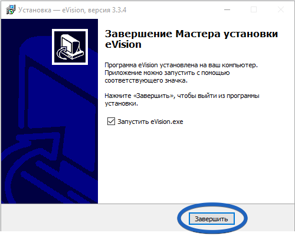

*   При необходимости выберите устройство для которого необходимо разрешить доступ

>>>>>  gd2md-html alert: inline image link here (to images/image120.png). Store image on your image server and adjust path/filename/extension if necessary.  (<a href="#">Back to top</a>)(<a href="#gdcalert126">Next alert</a>) >>>>> 

*   нажмите кнопку **Применить **

>>>>>  gd2md-html alert: inline image link here (to images/image121.png). Store image on your image server and adjust path/filename/extension if necessary.  (<a href="#">Back to top</a>)(<a href="#gdcalert127">Next alert</a>) >>>>> 

Окно редактирования закроется, в списке пользователей изменится имя, а также будет видно включен доступ

>>>>>  gd2md-html alert: inline image link here (to images/image122.png). Store image on your image server and adjust path/filename/extension if necessary.  (<a href="#">Back to top</a>)(<a href="#gdcalert128">Next alert</a>) >>>>> 

на каком-либо устройстве или запрещен

>>>>>  gd2md-html alert: inline image link here (to images/image123.png). Store image on your image server and adjust path/filename/extension if necessary.  (<a href="#">Back to top</a>)(<a href="#gdcalert129">Next alert</a>) >>>>> 

.

    22.
Редактирование множества пользователей
	В программе доступно редактирование множества пользователей. Для редактирования доступны следующие параметры:

*   Добавить выбранных пользователей в группу
*   Разрешить выбранным пользователям доступ на выбранных устройствах
*   Удалить выделенных пользователей

>>>>>  gd2md-html alert: inline image link here (to images/image124.png). Store image on your image server and adjust path/filename/extension if necessary.  (<a href="#">Back to top</a>)(<a href="#gdcalert130">Next alert</a>) >>>>> 

	Для того что бы редактировать несколько пользователей необходимо проделать следующие шаги:

*   Перейдите в раздел **Пользователи**

>>>>>  gd2md-html alert: inline image link here (to images/image125.png). Store image on your image server and adjust path/filename/extension if necessary.  (<a href="#">Back to top</a>)(<a href="#gdcalert131">Next alert</a>) >>>>> 

*   В таблице отметьте галочками нужных вам пользователей

>>>>>  gd2md-html alert: inline image link here (to images/image126.png). Store image on your image server and adjust path/filename/extension if necessary.  (<a href="#">Back to top</a>)(<a href="#gdcalert132">Next alert</a>) >>>>> 

*   Нажмите **Редактировать пользователей**

>>>>>  gd2md-html alert: inline image link here (to images/image127.png). Store image on your image server and adjust path/filename/extension if necessary.  (<a href="#">Back to top</a>)(<a href="#gdcalert133">Next alert</a>) >>>>> 

*   Появится окно редактирования, где вы можете назначить выбранным пользователям группу, а также разрешить доступ на одном или нескольких устройства, либо удалить выбранных пользователей
*   После того как нужные операции выполнены нажмите **Применить, **для сохранения сделанных изменений.

    23.
Добавление фотографий пользователю
При необходимости каждому пользователю можно добавить несколько фотографий. Добавление дополнительных фото позволит увеличить точность распознавания.

Чтобы добавить фото:

*   Откройте вкладку **Пользователи**, найдите сотрудника, для которого необходимо добавить фото:

>>>>>  gd2md-html alert: inline image link here (to images/image128.png). Store image on your image server and adjust path/filename/extension if necessary.  (<a href="#">Back to top</a>)(<a href="#gdcalert134">Next alert</a>) >>>>> 

*   Нажмите кнопку **Редактировать**. Откроется окно **Редактировать пользователя**

>>>>>  gd2md-html alert: inline image link here (to images/image129.png). Store image on your image server and adjust path/filename/extension if necessary.  (<a href="#">Back to top</a>)(<a href="#gdcalert135">Next alert</a>) >>>>> 

*   Нажмите кнопку **Добавить фото**

>>>>>  gd2md-html alert: inline image link here (to images/image130.png). Store image on your image server and adjust path/filename/extension if necessary.  (<a href="#">Back to top</a>)(<a href="#gdcalert136">Next alert</a>) >>>>> 

. Откроется окно для выбора и загрузки фотографии.

>>>>>  gd2md-html alert: inline image link here (to images/image131.png). Store image on your image server and adjust path/filename/extension if necessary.  (<a href="#">Back to top</a>)(<a href="#gdcalert137">Next alert</a>) >>>>> 

*   Выберите фото на компьютере.
*   Нажмите кнопку **Открыть**, выбранное фото загрузится в **eVision** и появится в окне редактирования пользователя.
*   Чтобы просмотреть фотографии пользователя, нажмите на фото. При наведении курсора на фото, появится подсказка с количеством фотографий

>>>>>  gd2md-html alert: inline image link here (to images/image132.png). Store image on your image server and adjust path/filename/extension if necessary.  (<a href="#">Back to top</a>)(<a href="#gdcalert138">Next alert</a>) >>>>> 

.

>>>>>  gd2md-html alert: inline image link here (to images/image133.png). Store image on your image server and adjust path/filename/extension if necessary.  (<a href="#">Back to top</a>)(<a href="#gdcalert139">Next alert</a>) >>>>> 

    24.
Удаление фотографий пользователя
При необходимости удалите неподходящие фото пользователя. Удаляйте не качественные фотографии, смазанные и сделанные при недостаточном освещении. Чтобы удалить фото:

*   Откройте вкладку **Пользователи**, найдите сотрудника, фото которого необходимо удалить:

>>>>>  gd2md-html alert: inline image link here (to images/image134.png). Store image on your image server and adjust path/filename/extension if necessary.  (<a href="#">Back to top</a>)(<a href="#gdcalert140">Next alert</a>) >>>>> 

*   Нажмите кнопку **Редактировать **

>>>>>  gd2md-html alert: inline image link here (to images/image135.png). Store image on your image server and adjust path/filename/extension if necessary.  (<a href="#">Back to top</a>)(<a href="#gdcalert141">Next alert</a>) >>>>> 

. Откроется окно **Редактировать пользователя**

>>>>>  gd2md-html alert: inline image link here (to images/image136.png). Store image on your image server and adjust path/filename/extension if necessary.  (<a href="#">Back to top</a>)(<a href="#gdcalert142">Next alert</a>) >>>>> 

*   В окне редактирования выберите фото, которое необходимо удалить, переключаясь между фотографиями кликом по ним:

>>>>>  gd2md-html alert: inline image link here (to images/image137.png). Store image on your image server and adjust path/filename/extension if necessary.  (<a href="#">Back to top</a>)(<a href="#gdcalert143">Next alert</a>) >>>>> 

*   Нажмите кнопку **Удалить фото **

>>>>>  gd2md-html alert: inline image link here (to images/image138.png). Store image on your image server and adjust path/filename/extension if necessary.  (<a href="#">Back to top</a>)(<a href="#gdcalert144">Next alert</a>) >>>>> 

. Откроется окно с подтверждением:

>>>>>  gd2md-html alert: inline image link here (to images/image139.png). Store image on your image server and adjust path/filename/extension if necessary.  (<a href="#">Back to top</a>)(<a href="#gdcalert145">Next alert</a>) >>>>> 

*   Нажмите кнопку **Удалить **

>>>>>  gd2md-html alert: inline image link here (to images/image140.png). Store image on your image server and adjust path/filename/extension if necessary.  (<a href="#">Back to top</a>)(<a href="#gdcalert146">Next alert</a>) >>>>> 

.
*   Выбранное фото будет удалено.

    25.
Удаление пользователя
Для того, чтобы удалить пользователя

*   Нажмите кнопку **Удалить пользователя **

>>>>>  gd2md-html alert: inline image link here (to images/image141.png). Store image on your image server and adjust path/filename/extension if necessary.  (<a href="#">Back to top</a>)(<a href="#gdcalert147">Next alert</a>) >>>>> 

, откроется окно подтверждения удаления:

>>>>>  gd2md-html alert: inline image link here (to images/image142.png). Store image on your image server and adjust path/filename/extension if necessary.  (<a href="#">Back to top</a>)(<a href="#gdcalert148">Next alert</a>) >>>>> 

*   Нажмите кнопку **Удалить **

>>>>>  gd2md-html alert: inline image link here (to images/image143.png). Store image on your image server and adjust path/filename/extension if necessary.  (<a href="#">Back to top</a>)(<a href="#gdcalert149">Next alert</a>) >>>>> 

Окно подтверждения закроется, запись удалится из списка пользователей.

    26.
Добавление пользователей из Истории
В **eVision **существует возможность добавлять новых пользователей и фотографии созданным пользователям из **Истории** при распознавании. Как включить распознавание см. пункты

>>>>>  gd2md-html alert: undefined internal link (link text: "Как активировать лицензию?"). Did you generate a TOC?  (<a href="#">Back to top</a>)(<a href="#gdcalert150">Next alert</a>) >>>>> 

[Как активировать лицензию?](#heading=h.sp1jtzprlj88) и

>>>>>  gd2md-html alert: undefined internal link (link text: "Как проверить видеоаналитику?"). Did you generate a TOC?  (<a href="#">Back to top</a>)(<a href="#gdcalert151">Next alert</a>) >>>>> 

[Как проверить видеоаналитику?](#heading=h.cys7rjeruw8m). Для того что-бы добавить пользователей из **Истории**:

*   Откройте вкладку **История **

>>>>>  gd2md-html alert: inline image link here (to images/image144.png). Store image on your image server and adjust path/filename/extension if necessary.  (<a href="#">Back to top</a>)(<a href="#gdcalert152">Next alert</a>) >>>>> 

>>>>>  gd2md-html alert: inline image link here (to images/image145.png). Store image on your image server and adjust path/filename/extension if necessary.  (<a href="#">Back to top</a>)(<a href="#gdcalert153">Next alert</a>) >>>>> 

*   Выберите из колонки **Фото **подходящее по качеству и освещению изображение человека,
*   В строке с выбранным фото нажмите кнопку **Добавить пользователя **

>>>>>  gd2md-html alert: inline image link here (to images/image146.png). Store image on your image server and adjust path/filename/extension if necessary.  (<a href="#">Back to top</a>)(<a href="#gdcalert154">Next alert</a>) >>>>> 

,

>>>>>  gd2md-html alert: inline image link here (to images/image147.png). Store image on your image server and adjust path/filename/extension if necessary.  (<a href="#">Back to top</a>)(<a href="#gdcalert155">Next alert</a>) >>>>> 

Откроется окно **Добавление нового пользователя**.

*   В окне редактирования пользователя заполните необходимые поля:

>>>>>  gd2md-html alert: inline image link here (to images/image148.png). Store image on your image server and adjust path/filename/extension if necessary.  (<a href="#">Back to top</a>)(<a href="#gdcalert156">Next alert</a>) >>>>> 

*   Нажмите кнопку **Применить**,
*   Проверьте на вкладке **Пользователи** созданную запись.

    27.
Добавление фотографий пользователю из Истории
В **eVision** можно добавить дополнительные фото созданным пользователям из **Истории**. Для этого необходимо точно указывать имя пользователя при выборе фото. Чтобы добавить фото из **Истории**:

*   Откройте вкладку **История**

>>>>>  gd2md-html alert: inline image link here (to images/image149.png). Store image on your image server and adjust path/filename/extension if necessary.  (<a href="#">Back to top</a>)(<a href="#gdcalert157">Next alert</a>) >>>>> 

*   Выберите из колонки **Фото **изображение, которое было-бы лучше чем то, что уже есть у пользователя:

>>>>>  gd2md-html alert: inline image link here (to images/image150.png). Store image on your image server and adjust path/filename/extension if necessary.  (<a href="#">Back to top</a>)(<a href="#gdcalert158">Next alert</a>) >>>>> 

*   В строке с выбранным фото нажмите кнопку **Добавить пользователя **

>>>>>  gd2md-html alert: inline image link here (to images/image151.png). Store image on your image server and adjust path/filename/extension if necessary.  (<a href="#">Back to top</a>)(<a href="#gdcalert159">Next alert</a>) >>>>> 

Откроется окно **Добавление нового пользователя:**

*   В поле **Введите имя и фамилию **введите точное имя пользователя, которому необходимо добавить выбранное фото. Будьте внимательны, указывайте имя только так, как указано в базе персон без лишних символов и пробелов.

>>>>>  gd2md-html alert: inline image link here (to images/image152.png). Store image on your image server and adjust path/filename/extension if necessary.  (<a href="#">Back to top</a>)(<a href="#gdcalert160">Next alert</a>) >>>>> 

*   Нажмите кнопку **Применить **

>>>>>  gd2md-html alert: inline image link here (to images/image153.png). Store image on your image server and adjust path/filename/extension if necessary.  (<a href="#">Back to top</a>)(<a href="#gdcalert161">Next alert</a>) >>>>> 

. Появится уведомление:

>>>>>  gd2md-html alert: inline image link here (to images/image154.png). Store image on your image server and adjust path/filename/extension if necessary.  (<a href="#">Back to top</a>)(<a href="#gdcalert162">Next alert</a>) >>>>> 

*   Нажмите кнопку **Добавить фотографию**. Окно редактирования закроется.
*   Проверьте добавленное фото пользователя на вкладке **Пользователи.**

>>>>>  gd2md-html alert: inline image link here (to images/image155.png). Store image on your image server and adjust path/filename/extension if necessary.  (<a href="#">Back to top</a>)(<a href="#gdcalert163">Next alert</a>) >>>>> 

Теперь при наведении курсора на фото появляется всплывающая подсказка с количеством фото у данного пользователя. При клике мышью на фото, можно посмотреть другие фотографии пользователя.

##

17.
Группы
Данный раздел предназначен для создания и редактирования групп, в которые можно объединять пользователей. По группам формируются отчеты (см. пункт

>>>>>  gd2md-html alert: undefined internal link (link text: "Отчеты"). Did you generate a TOC?  (<a href="#">Back to top</a>)(<a href="#gdcalert164">Next alert</a>) >>>>> 

[Отчеты](#heading=h.jzffv8ali8nu).)

Попасть в раздел создания и редактирования групп можно через вкладку **Пользователи, нажав на **значок **Переключиться на группы в верхней части экрана **

>>>>>  gd2md-html alert: inline image link here (to images/image156.png). Store image on your image server and adjust path/filename/extension if necessary.  (<a href="#">Back to top</a>)(<a href="#gdcalert165">Next alert</a>) >>>>> 

>>>>>  gd2md-html alert: inline image link here (to images/image157.png). Store image on your image server and adjust path/filename/extension if necessary.  (<a href="#">Back to top</a>)(<a href="#gdcalert166">Next alert</a>) >>>>> 

Для **Групп** доступны следующие операции:

*   Добавление группы.
*   Редактирование названия группы.
*   Удаление группы. При удалении группы пользователи не удаляются, а исключаются из группы.
*   Поиск.
*   Обновление списка групп.
*   Экспорт таблицы групп в файлы разных форматов.

    Данные в таблице можно сортировать по Дате и по Названию группы.

    28.
Добавление группы
Для того, чтобы добавить группу:

*   Нажмите кнопку **Добавить новую группу**

>>>>>  gd2md-html alert: inline image link here (to images/image158.png). Store image on your image server and adjust path/filename/extension if necessary.  (<a href="#">Back to top</a>)(<a href="#gdcalert167">Next alert</a>) >>>>> 

, откроется окно **Добавить новую группу**:

>>>>>  gd2md-html alert: inline image link here (to images/image159.png). Store image on your image server and adjust path/filename/extension if necessary.  (<a href="#">Back to top</a>)(<a href="#gdcalert168">Next alert</a>) >>>>> 

*   Введите название группы. Например, названия групп могут быть по названиям отделов. ** **
*   В выпадающем списке **Пользователи **можно сразу же добавить в группу участников.

>>>>>  gd2md-html alert: inline image link here (to images/image160.png). Store image on your image server and adjust path/filename/extension if necessary.  (<a href="#">Back to top</a>)(<a href="#gdcalert169">Next alert</a>) >>>>> 

*   Нажмите кнопку **Применить **

>>>>>  gd2md-html alert: inline image link here (to images/image161.png). Store image on your image server and adjust path/filename/extension if necessary.  (<a href="#">Back to top</a>)(<a href="#gdcalert170">Next alert</a>) >>>>> 

Окно добавления закроется и в списке групп появится новая группа.

    29.
Редактирование группы
Для того, чтобы изменить название группы:

*   Нажмите кнопку **Редактировать**

>>>>>  gd2md-html alert: inline image link here (to images/image162.png). Store image on your image server and adjust path/filename/extension if necessary.  (<a href="#">Back to top</a>)(<a href="#gdcalert171">Next alert</a>) >>>>> 

, откроется окно **Редактировать группу**:

>>>>>  gd2md-html alert: inline image link here (to images/image163.png). Store image on your image server and adjust path/filename/extension if necessary.  (<a href="#">Back to top</a>)(<a href="#gdcalert172">Next alert</a>) >>>>> 

*   При необходимости измените название группы, и участников.
*   Нажмите кнопку **Применить **

>>>>>  gd2md-html alert: inline image link here (to images/image164.png). Store image on your image server and adjust path/filename/extension if necessary.  (<a href="#">Back to top</a>)(<a href="#gdcalert173">Next alert</a>) >>>>> 

Окно редактирования закроется и в списке групп изменится название группы.

>>>>>  gd2md-html alert: inline image link here (to images/image165.png). Store image on your image server and adjust path/filename/extension if necessary.  (<a href="#">Back to top</a>)(<a href="#gdcalert174">Next alert</a>) >>>>> 

    30.
Удаление группы
Для того, чтобы удалить группу:

*   Нажмите кнопку **Удалить группу**

>>>>>  gd2md-html alert: inline image link here (to images/image166.png). Store image on your image server and adjust path/filename/extension if necessary.  (<a href="#">Back to top</a>)(<a href="#gdcalert175">Next alert</a>) >>>>> 

, откроется окно подтверждения удаления:

>>>>>  gd2md-html alert: inline image link here (to images/image167.png). Store image on your image server and adjust path/filename/extension if necessary.  (<a href="#">Back to top</a>)(<a href="#gdcalert176">Next alert</a>) >>>>> 

*   Нажмите кнопку **Удалить  **

>>>>>  gd2md-html alert: inline image link here (to images/image168.png). Store image on your image server and adjust path/filename/extension if necessary.  (<a href="#">Back to top</a>)(<a href="#gdcalert177">Next alert</a>) >>>>> 

Окно подтверждения закроется, группа удалится из списка групп.

18.
Номера
На вкладке **Номера** создается база данных автомобильных номеров для распознавания. Для каждого номера настраивается доступ на устройства, добавленные в **eVision**, тем самым разрешается  или запрещается автомобилю проезд на территорию.

>>>>>  gd2md-html alert: inline image link here (to images/image169.png). Store image on your image server and adjust path/filename/extension if necessary.  (<a href="#">Back to top</a>)(<a href="#gdcalert178">Next alert</a>) >>>>> 

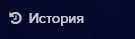

Поддерживаются только российские автомобильные однорядные номера:

>>>>>  gd2md-html alert: inline image link here (to images/image170.png). Store image on your image server and adjust path/filename/extension if necessary.  (<a href="#">Back to top</a>)(<a href="#gdcalert179">Next alert</a>) >>>>> 

                     Номер					   Регион

Номер допускается указывать тремя буквами А,В,Е,К,М,Н,О,Р,С,Т,У,Х и тремя цифрами.

Регион допускается указывать двумя или тремя цифрами.

Для автомобильных номеров доступны следующие операции:

*   Добавление номера.
*   Редактирование номера и доступа через устройства.
*   Удаление номера.
*   Поиск.
*   Обновление списка номеров.
*   Экспорт таблицы номеров в файлы разных форматов.

В поле Доступ в списке номеров значок

>>>>>  gd2md-html alert: inline image link here (to images/image171.png). Store image on your image server and adjust path/filename/extension if necessary.  (<a href="#">Back to top</a>)(<a href="#gdcalert180">Next alert</a>) >>>>> 

 означает, что у автомобильного номера есть доступ на территорию через устройства, значок

>>>>>  gd2md-html alert: inline image link here (to images/image172.png). Store image on your image server and adjust path/filename/extension if necessary.  (<a href="#">Back to top</a>)(<a href="#gdcalert181">Next alert</a>) >>>>> 

  - доступа нет.

Данные в таблице номеров можно сортировать по Дате, по Номеру и по Доступу.

    31.
Добавление номера
Для того, чтобы добавить номер:

*   Нажмите кнопку **Добавить новый номер**

>>>>>  gd2md-html alert: inline image link here (to images/image173.png). Store image on your image server and adjust path/filename/extension if necessary.  (<a href="#">Back to top</a>)(<a href="#gdcalert182">Next alert</a>) >>>>> 

, откроется окно **Добавление нового номера**:

>>>>>  gd2md-html alert: inline image link here (to images/image174.png). Store image on your image server and adjust path/filename/extension if necessary.  (<a href="#">Back to top</a>)(<a href="#gdcalert183">Next alert</a>) >>>>> 

*   Введите серию, номер и код региона автомобильного номера в соответствующее поле. При этом верхний графический элемент заполняется автоматически.

**! **Обратите внимание, что в поле Автомобильный номер серию номера можно вводить русскими и английскими буквами. Однако при вводе русских букв, они автоматически будут преобразованы в заглавные английские. Внешне буквы будут выглядеть одинаково, но записан номер будет в англоязычном формате. Данная транслитерация необходима для хранения номеров в едином формате. Поле Автомобильные номера непринимает русские буквы Б,Г,Д,Ё,Ж,З,И,Л,П,Ф,Ц,Ч,Ш,Щ,Й,Ь,Ъ,Э,Ю,Я.

Транслитерация русских букв в английские:

<table>
  <tr>
   <td colspan="2" >Русская буква
   </td>
   <td colspan="2" >Английская буква
   </td>
  </tr>
  <tr>
   <td>Печатная буква
   </td>
   <td>Произношение
   </td>
   <td>Печатная буква
   </td>
   <td>Произношение
   </td>
  </tr>
  <tr>
   <td>А,а
   </td>
   <td>[а]
   </td>
   <td>A,a
   </td>
   <td>[эй]
   </td>
  </tr>
  <tr>
   <td>В,в
   </td>
   <td>[вэ]
   </td>
   <td>B,b
   </td>
   <td>[би]
   </td>
  </tr>
  <tr>
   <td>С,с
   </td>
   <td>[эс]
   </td>
   <td>C,c
   </td>
   <td>[си]
   </td>
  </tr>
  <tr>
   <td>Е,е
   </td>
   <td>[е]
   </td>
   <td>E,e
   </td>
   <td>[и]
   </td>
  </tr>
  <tr>
   <td>Н,н
   </td>
   <td>[эн]
   </td>
   <td>H,h
   </td>
   <td>[эйч]
   </td>
  </tr>
  <tr>
   <td>К,к
   </td>
   <td>[ка]
   </td>
   <td>K,k
   </td>
   <td>[кей]
   </td>
  </tr>
  <tr>
   <td>М,м
   </td>
   <td>[эм]
   </td>
   <td>M,m
   </td>
   <td>[эм]
   </td>
  </tr>
  <tr>
   <td>О,о
   </td>
   <td>[о]
   </td>
   <td>O,o
   </td>
   <td>[оу]
   </td>
  </tr>
  <tr>
   <td>Р,р
   </td>
   <td>[эр]
   </td>
   <td>P,p
   </td>
   <td>[пи]
   </td>
  </tr>
  <tr>
   <td>Т,т
   </td>
   <td>[т]
   </td>
   <td>T,t
   </td>
   <td>[ти]
   </td>
  </tr>
  <tr>
   <td>Х,х
   </td>
   <td>[ха]
   </td>
   <td>X,x
   </td>
   <td>[экс]
   </td>
  </tr>
  <tr>
   <td>У,у
   </td>
   <td>[у]
   </td>
   <td>Y,y
   </td>
   <td>[уай]
   </td>
  </tr>
</table>

*   Выберите устройство или несколько устройств, через которые транспортному средству разрешен въезд.  Если устройство не выбрано, то доступ будет закрыт. Это поле можно заполнить позднее при операции редактирования.

>>>>>  gd2md-html alert: inline image link here (to images/image175.png). Store image on your image server and adjust path/filename/extension if necessary.  (<a href="#">Back to top</a>)(<a href="#gdcalert184">Next alert</a>) >>>>> 

*   Нажмите кнопку **Применить **

>>>>>  gd2md-html alert: inline image link here (to images/image176.png). Store image on your image server and adjust path/filename/extension if necessary.  (<a href="#">Back to top</a>)(<a href="#gdcalert185">Next alert</a>) >>>>> 

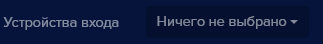

Окно добавления номера закроется и в списке номеров появится новый автомобильный номер.

>>>>>  gd2md-html alert: inline image link here (to images/image177.png). Store image on your image server and adjust path/filename/extension if necessary.  (<a href="#">Back to top</a>)(<a href="#gdcalert186">Next alert</a>) >>>>> 

    32.
Редактирование номера
Для того, чтобы изменить данные автомобильного номера или доступ через устройства:

*   Нажмите кнопку **Редактировать**

>>>>>  gd2md-html alert: inline image link here (to images/image178.png). Store image on your image server and adjust path/filename/extension if necessary.  (<a href="#">Back to top</a>)(<a href="#gdcalert187">Next alert</a>) >>>>> 

, откроется окно **Редактировать номер**:

>>>>>  gd2md-html alert: inline image link here (to images/image179.png). Store image on your image server and adjust path/filename/extension if necessary.  (<a href="#">Back to top</a>)(<a href="#gdcalert188">Next alert</a>) >>>>> 

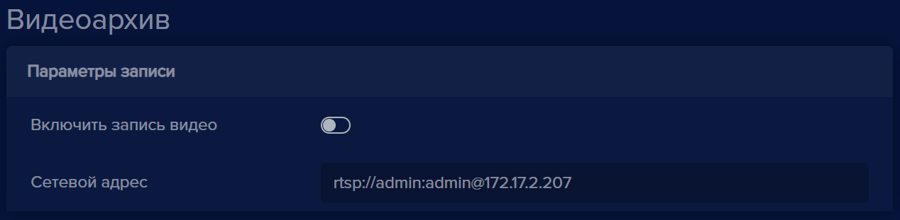

*   При необходимости, измените номер или выберите устройства

>>>>>  gd2md-html alert: inline image link here (to images/image180.png). Store image on your image server and adjust path/filename/extension if necessary.  (<a href="#">Back to top</a>)(<a href="#gdcalert189">Next alert</a>) >>>>> 

*   Нажмите кнопку **Применить **

>>>>>  gd2md-html alert: inline image link here (to images/image181.png). Store image on your image server and adjust path/filename/extension if necessary.  (<a href="#">Back to top</a>)(<a href="#gdcalert190">Next alert</a>) >>>>> 

Окно редактирования закроется и в списке номеров отобразятся сделанные изменения.

>>>>>  gd2md-html alert: inline image link here (to images/image182.png). Store image on your image server and adjust path/filename/extension if necessary.  (<a href="#">Back to top</a>)(<a href="#gdcalert191">Next alert</a>) >>>>> 

    33.
Удаление номера
Для того, чтобы удалить номер:

*   Нажмите кнопку **Удалить номер**

>>>>>  gd2md-html alert: inline image link here (to images/image183.png). Store image on your image server and adjust path/filename/extension if necessary.  (<a href="#">Back to top</a>)(<a href="#gdcalert192">Next alert</a>) >>>>> 

, откроется окно подтверждения удаления:

>>>>>  gd2md-html alert: inline image link here (to images/image184.png). Store image on your image server and adjust path/filename/extension if necessary.  (<a href="#">Back to top</a>)(<a href="#gdcalert193">Next alert</a>) >>>>> 

*   Нажмите кнопку **Удалить  **

>>>>>  gd2md-html alert: inline image link here (to images/image185.png). Store image on your image server and adjust path/filename/extension if necessary.  (<a href="#">Back to top</a>)(<a href="#gdcalert194">Next alert</a>) >>>>> 

Окно подтверждения закроется, номер удалиться из списка номеров.

19.
Видеоархив
Данный раздел предназначен для просмотра видеоданных в архиве, полученных с выбранного устройства.

>>>>>  gd2md-html alert: inline image link here (to images/image186.png). Store image on your image server and adjust path/filename/extension if necessary.  (<a href="#">Back to top</a>)(<a href="#gdcalert195">Next alert</a>) >>>>> 

    34.
Просмотр видеоданных из архива
Для  просмотра видеоданных:

*   Выберите устройство из списка

>>>>>  gd2md-html alert: inline image link here (to images/image187.png). Store image on your image server and adjust path/filename/extension if necessary.  (<a href="#">Back to top</a>)(<a href="#gdcalert196">Next alert</a>) >>>>> 

*   Выберите из выпадающего календаря или введите вручную период времени, за который нужно отобразить видеоархив. **Внимание**: период хранения видео зависит от настроек, по умолчанию 3 суток (см. пункт

>>>>>  gd2md-html alert: undefined internal link (link text: "Настройки времени хранения"). Did you generate a TOC?  (<a href="#">Back to top</a>)(<a href="#gdcalert197">Next alert</a>) >>>>> 

[Настройки времени хранения](#heading=h.jr9aalsrtdc9))

>>>>>  gd2md-html alert: inline image link here (to images/image188.png). Store image on your image server and adjust path/filename/extension if necessary.  (<a href="#">Back to top</a>)(<a href="#gdcalert198">Next alert</a>) >>>>> 

*   В шкале времени выберите видеоролик,  который необходимо воспроизвести (продолжительность одного ролика 10 минут)

>>>>>  gd2md-html alert: inline image link here (to images/image189.png). Store image on your image server and adjust path/filename/extension if necessary.  (<a href="#">Back to top</a>)(<a href="#gdcalert199">Next alert</a>) >>>>> 

Отобразиться запись видеоархива за выбранное время. Активная часть шкалы подсветится желтым

>>>>>  gd2md-html alert: inline image link here (to images/image190.png). Store image on your image server and adjust path/filename/extension if necessary.  (<a href="#">Back to top</a>)(<a href="#gdcalert200">Next alert</a>) >>>>> 

Для видео доступны операции управления:

<table>
  <tr>
   <td>

>>>>>  gd2md-html alert: inline image link here (to images/image191.png). Store image on your image server and adjust path/filename/extension if necessary.  (<a href="#">Back to top</a>)(<a href="#gdcalert201">Next alert</a>) >>>>> 

   </td>
   <td>воспроизведение видео
   </td>
  </tr>
  <tr>
   <td>

>>>>>  gd2md-html alert: inline image link here (to images/image192.png). Store image on your image server and adjust path/filename/extension if necessary.  (<a href="#">Back to top</a>)(<a href="#gdcalert202">Next alert</a>) >>>>> 

   </td>
   <td>остановка воспроизведения
   </td>
  </tr>
  <tr>
   <td>

>>>>>  gd2md-html alert: inline image link here (to images/image193.png). Store image on your image server and adjust path/filename/extension if necessary.  (<a href="#">Back to top</a>)(<a href="#gdcalert203">Next alert</a>) >>>>> 

   </td>
   <td>настройка звука. Имеет смысл только в случае, если устройство-источник оборудовано микрофоном и записывало звук
   </td>
  </tr>
  <tr>
   <td>

>>>>>  gd2md-html alert: inline image link here (to images/image194.png). Store image on your image server and adjust path/filename/extension if necessary.  (<a href="#">Back to top</a>)(<a href="#gdcalert204">Next alert</a>) >>>>> 

>>>>>  gd2md-html alert: inline image link here (to images/image195.png). Store image on your image server and adjust path/filename/extension if necessary.  (<a href="#">Back to top</a>)(<a href="#gdcalert205">Next alert</a>) >>>>> 

   </td>
   <td>полноэкранное видео или  обычное
   </td>
  </tr>
  <tr>
   <td>

>>>>>  gd2md-html alert: inline image link here (to images/image196.png). Store image on your image server and adjust path/filename/extension if necessary.  (<a href="#">Back to top</a>)(<a href="#gdcalert206">Next alert</a>) >>>>> 

   </td>
   <td>меню с пунктами <strong>Скачать</strong> и <strong>Картинка в картинке</strong>
   </td>
  </tr>
  <tr>
   <td>

>>>>>  gd2md-html alert: inline image link here (to images/image197.png). Store image on your image server and adjust path/filename/extension if necessary.  (<a href="#">Back to top</a>)(<a href="#gdcalert207">Next alert</a>) >>>>> 

   </td>
   <td> скачивание выбранного видео
   </td>
  </tr>
  <tr>
   <td>

>>>>>  gd2md-html alert: inline image link here (to images/image198.png). Store image on your image server and adjust path/filename/extension if necessary.  (<a href="#">Back to top</a>)(<a href="#gdcalert208">Next alert</a>) >>>>> 

   </td>
   <td>просмотр выбранного видео в отдельном окне
   </td>
  </tr>
</table>

20.
История
Данная вкладка

>>>>>  gd2md-html alert: inline image link here (to images/image199.png). Store image on your image server and adjust path/filename/extension if necessary.  (<a href="#">Back to top</a>)(<a href="#gdcalert209">Next alert</a>) >>>>> 

 служит для хранения истории распознанных силуэтов,лиц автотранспорта и автомобильных номеров, также здесь отображаются события: **открытие замка, доступ запрещен, голосовое уведомление**.

>>>>>  gd2md-html alert: inline image link here (to images/image200.png). Store image on your image server and adjust path/filename/extension if necessary.  (<a href="#">Back to top</a>)(<a href="#gdcalert210">Next alert</a>) >>>>> 

>>>>>  gd2md-html alert: inline image link here (to images/image201.png). Store image on your image server and adjust path/filename/extension if necessary.  (<a href="#">Back to top</a>)(<a href="#gdcalert211">Next alert</a>) >>>>> 

 - Область для выбора периода просмотра истории. При нажати на календарь появляется возможность выбора периода и времени отображения событий:

>>>>>  gd2md-html alert: inline image link here (to images/image202.png). Store image on your image server and adjust path/filename/extension if necessary.  (<a href="#">Back to top</a>)(<a href="#gdcalert212">Next alert</a>) >>>>> 

>>>>>  gd2md-html alert: inline image link here (to images/image203.png). Store image on your image server and adjust path/filename/extension if necessary.  (<a href="#">Back to top</a>)(<a href="#gdcalert213">Next alert</a>) >>>>> 

 - Поле **Источник **позволяет выбирать события в истории по выбранному устройству.

>>>>>  gd2md-html alert: inline image link here (to images/image204.png). Store image on your image server and adjust path/filename/extension if necessary.  (<a href="#">Back to top</a>)(<a href="#gdcalert214">Next alert</a>) >>>>> 

 - Поле **Тип** позволяет выбирать тип объектов для просмотра в истории. При выборе **Лицо **в истории отображается распознавание лиц. **Пользователей **- людей, при выборе **Автомобиль, Автомобильные** **номера** - в истории отображаются** **автомобили,и номера автомобилей. Для включения функцией распознавания нужно активировать опции **Видеоаналитика**, как это сделать можно посмотреть в соответствующем

>>>>>  gd2md-html alert: undefined internal link (link text: "разделе документации"). Did you generate a TOC?  (<a href="#">Back to top</a>)(<a href="#gdcalert215">Next alert</a>) >>>>> 

[разделе документации](#heading=h.n2vl2bdev4k2). Если не выбран какой-либо тип, то в истории отображаются все распознанные объекты.

>>>>>  gd2md-html alert: inline image link here (to images/image205.png). Store image on your image server and adjust path/filename/extension if necessary.  (<a href="#">Back to top</a>)(<a href="#gdcalert216">Next alert</a>) >>>>> 

 - Поле **Журнал действий **позволяет выбрать определенные действия, которые были связаны с замком и уведомлениями. Доступны варианты: **Открытие замка**, **Доступ запрещен **и **Голосовые уведомления**.

Пример данных:

>>>>>  gd2md-html alert: inline image link here (to images/image206.png). Store image on your image server and adjust path/filename/extension if necessary.  (<a href="#">Back to top</a>)(<a href="#gdcalert217">Next alert</a>) >>>>> 

 - Распознано лицо человека (включена **Видеоаналитика **и активирован режим **Распознавания лиц**)**.**

>>>>>  gd2md-html alert: inline image link here (to images/image207.png). Store image on your image server and adjust path/filename/extension if necessary.  (<a href="#">Back to top</a>)(<a href="#gdcalert218">Next alert</a>) >>>>> 

>>>>>  gd2md-html alert: inline image link here (to images/image208.png). Store image on your image server and adjust path/filename/extension if necessary.  (<a href="#">Back to top</a>)(<a href="#gdcalert219">Next alert</a>) >>>>> 

- Распознано лицо человека, которого нет в базе пользователей

>>>>>  gd2md-html alert: inline image link here (to images/image209.png). Store image on your image server and adjust path/filename/extension if necessary.  (<a href="#">Back to top</a>)(<a href="#gdcalert220">Next alert</a>) >>>>> 

- Распознано лицо человека, который есть в базе пользователей

>>>>>  gd2md-html alert: inline image link here (to images/image210.png). Store image on your image server and adjust path/filename/extension if necessary.  (<a href="#">Back to top</a>)(<a href="#gdcalert221">Next alert</a>) >>>>> 

- Распознан силуэт человека.

>>>>>  gd2md-html alert: inline image link here (to images/image211.png). Store image on your image server and adjust path/filename/extension if necessary.  (<a href="#">Back to top</a>)(<a href="#gdcalert222">Next alert</a>) >>>>> 

- Распознан силуэт автомобиля

>>>>>  gd2md-html alert: inline image link here (to images/image212.png). Store image on your image server and adjust path/filename/extension if necessary.  (<a href="#">Back to top</a>)(<a href="#gdcalert223">Next alert</a>) >>>>> 

- Распознан Автомобильный номер, которого нет в базе автомобильных номеров.

>>>>>  gd2md-html alert: inline image link here (to images/image213.png). Store image on your image server and adjust path/filename/extension if necessary.  (<a href="#">Back to top</a>)(<a href="#gdcalert224">Next alert</a>) >>>>> 

 - Распознан Автомобильный номер, который есть в базе номеров.

>>>>>  gd2md-html alert: inline image link here (to images/image214.png). Store image on your image server and adjust path/filename/extension if necessary.  (<a href="#">Back to top</a>)(<a href="#gdcalert225">Next alert</a>) >>>>> 

>>>>>  gd2md-html alert: inline image link here (to images/image215.png). Store image on your image server and adjust path/filename/extension if necessary.  (<a href="#">Back to top</a>)(<a href="#gdcalert226">Next alert</a>) >>>>> 

 - Доступ запрещен. Данному пользователю или автомобильному номеру запрещен доступ на устройстве

>>>>>  gd2md-html alert: inline image link here (to images/image216.png). Store image on your image server and adjust path/filename/extension if necessary.  (<a href="#">Back to top</a>)(<a href="#gdcalert227">Next alert</a>) >>>>> 

 - Точность с которой распознанное лицо совпадает с лицом пользователя

>>>>>  gd2md-html alert: inline image link here (to images/image217.png). Store image on your image server and adjust path/filename/extension if necessary.  (<a href="#">Back to top</a>)(<a href="#gdcalert228">Next alert</a>) >>>>> 

>>>>>  gd2md-html alert: inline image link here (to images/image218.png). Store image on your image server and adjust path/filename/extension if necessary.  (<a href="#">Back to top</a>)(<a href="#gdcalert229">Next alert</a>) >>>>> 

 - Распознано лицо человека, который есть в базе пользователей, данному сотруднику доступ на устройстве разрешен

>>>>>  gd2md-html alert: inline image link here (to images/image219.png). Store image on your image server and adjust path/filename/extension if necessary.  (<a href="#">Back to top</a>)(<a href="#gdcalert230">Next alert</a>) >>>>> 

 - Голосовое уведомление по SIP протоколу

>>>>>  gd2md-html alert: inline image link here (to images/image220.png). Store image on your image server and adjust path/filename/extension if necessary.  (<a href="#">Back to top</a>)(<a href="#gdcalert231">Next alert</a>) >>>>> 

Данные в **истории** можно сортировать по дате, источнику, идентификатору и по точности. А также, в **Истории **доступны операции: поиск, обновление данных, экспорт событий истории в файлы различных форматов.

>>>>>  gd2md-html alert: inline image link here (to images/image221.png). Store image on your image server and adjust path/filename/extension if necessary.  (<a href="#">Back to top</a>)(<a href="#gdcalert232">Next alert</a>) >>>>> 

Если алгоритм распознавания не может установить сходство с имеющимися объектами в базе то в поле **Идентификатор ** появится знак * (“Звездочка”), за сравнение отвечает параметр **Порог распознавания**.

21.
Отчеты
На вкладке **Отчеты** находятся пункты: **Пользователи, Группы, Устройства, Уникальные**, **Учет рабочего времени**. В каждом отчете есть календарь, в котором можно выбрать диапазон дат и время для отображения информации.

  Область для выбора дат и времени. При нажатии на календарь появляется возможность выбора дней и времени отображения событий:

>>>>>  gd2md-html alert: inline image link here (to images/image222.png). Store image on your image server and adjust path/filename/extension if necessary.  (<a href="#">Back to top</a>)(<a href="#gdcalert233">Next alert</a>) >>>>> 

В каждом отчете доступны операции: поиск, обновление данных, экспорт событий истории в файлы различных форматов.

    35.
Отчет по пользователям

>>>>>  gd2md-html alert: inline image link here (to images/image223.png). Store image on your image server and adjust path/filename/extension if necessary.  (<a href="#">Back to top</a>)(<a href="#gdcalert234">Next alert</a>) >>>>> 

В данном отчете отображается информация по посещениям пользователей.

**Только отсутствующие **- данная опция включает отображение в отчете пользователей, которые не распознаны, в выбранном временном промежутке.

<table>
  <tr>
   <td>

>>>>>  gd2md-html alert: inline image link here (to images/image224.png). Store image on your image server and adjust path/filename/extension if necessary.  (<a href="#">Back to top</a>)(<a href="#gdcalert235">Next alert</a>) >>>>> 

>>>>>  gd2md-html alert: inline image link here (to images/image225.png). Store image on your image server and adjust path/filename/extension if necessary.  (<a href="#">Back to top</a>)(<a href="#gdcalert236">Next alert</a>) >>>>> 

   </td>
   <td> Данные поля предоставляют выбор для регистрации пользователей на устройствах входа и выхода.
   </td>
  </tr>
</table>

    36.
Отчет по группам

>>>>>  gd2md-html alert: inline image link here (to images/image226.png). Store image on your image server and adjust path/filename/extension if necessary.  (<a href="#">Back to top</a>)(<a href="#gdcalert237">Next alert</a>) >>>>> 

В данном отчете отображается информация по распознаванию пользователей по группам, в которые включены. Отображается количество распознанных пользователей в каждой группе.

    37.
Отчет по устройствам

>>>>>  gd2md-html alert: inline image link here (to images/image227.png). Store image on your image server and adjust path/filename/extension if necessary.  (<a href="#">Back to top</a>)(<a href="#gdcalert238">Next alert</a>) >>>>> 

В данном отчете отображается количество распознанных персон по каждому устройству.

    38.
Отчет по уникальным пользователям

>>>>>  gd2md-html alert: inline image link here (to images/image228.png). Store image on your image server and adjust path/filename/extension if necessary.  (<a href="#">Back to top</a>)(<a href="#gdcalert239">Next alert</a>) >>>>> 

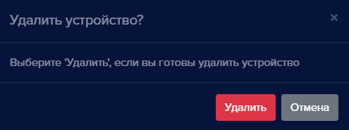

В данном отчете отображается количество уникальных распознанных пользователей.

>>>>>  gd2md-html alert: inline image link here (to images/image229.png). Store image on your image server and adjust path/filename/extension if necessary.  (<a href="#">Back to top</a>)(<a href="#gdcalert240">Next alert</a>) >>>>> 

 - поле **Источник **позволяет отобразить в отчете уникальных пользователей с выбранного устройства

>>>>>  gd2md-html alert: inline image link here (to images/image230.png). Store image on your image server and adjust path/filename/extension if necessary.  (<a href="#">Back to top</a>)(<a href="#gdcalert241">Next alert</a>) >>>>> 

 - пункт **Чувствительность** позволяет увеличить или уменьшить точность с которой отображаются распознанные пользователи.

    39.
Отчет Учет рабочего времени

>>>>>  gd2md-html alert: inline image link here (to images/image231.png). Store image on your image server and adjust path/filename/extension if necessary.  (<a href="#">Back to top</a>)(<a href="#gdcalert242">Next alert</a>) >>>>> 

	В данном отчете формируются сводные данные о суммарном времени работы по пользователю за определенный период.

22.
Общие настройки
Меню общих настроек содержит настройки времени хранения записей истории и видеоархива, настройки переадресации портов, настройки UPnP протокола, обновление **eVision**, настройки распознавания, а также экспорт и импорт настроек, устройств, пользователей,и номеров.

Нажмите кнопку общих настроек

>>>>>  gd2md-html alert: inline image link here (to images/image232.png). Store image on your image server and adjust path/filename/extension if necessary.  (<a href="#">Back to top</a>)(<a href="#gdcalert243">Next alert</a>) >>>>> 

, выберите пункт **Настройки**

>>>>>  gd2md-html alert: inline image link here (to images/image233.png). Store image on your image server and adjust path/filename/extension if necessary.  (<a href="#">Back to top</a>)(<a href="#gdcalert244">Next alert</a>) >>>>> 

. Откроется меню настроек:

>>>>>  gd2md-html alert: inline image link here (to images/image234.png). Store image on your image server and adjust path/filename/extension if necessary.  (<a href="#">Back to top</a>)(<a href="#gdcalert245">Next alert</a>) >>>>> 

    40.
Настройки времени хранения
**Настройки времени хранения** позволяют менять время хранения файлов в видеоархиве и время хранения записей в истории. По умолчанию видеоархив хранится 3 суток, записи в истории хранятся 90 суток.

>>>>>  gd2md-html alert: inline image link here (to images/image235.png). Store image on your image server and adjust path/filename/extension if necessary.  (<a href="#">Back to top</a>)(<a href="#gdcalert246">Next alert</a>) >>>>> 

    41.
Переадресация портов
	**Переадресация портов** позволяет создать подключение к серверу **eVision** с внешних IP адресов, через интернет. В поле **Внешний порт **указывается номер порта, на который необходимо включить переадресацию. Диапазон допустимых портов от 1024 до 65535. Поле **Внешний IP **заполняется автоматически после сохранения настроек и после проверки локальной сети. Если маршрутизатор локальной сети позволяет пробросить порт, то в поле **Внешний IP **появляется внешний IP адрес. Из сети интернет будет доступен интерфейс **eVision** с внешним IP и указанным портом.

>>>>>  gd2md-html alert: inline image link here (to images/image236.png). Store image on your image server and adjust path/filename/extension if necessary.  (<a href="#">Back to top</a>)(<a href="#gdcalert247">Next alert</a>) >>>>> 

! Если после применения настройки и перезагрузки системы в поле **Внешний IP **не отобразиться внешний адрес роутера, то маршрутизатор локальной сети не позволяет создать разрешающее правило, для этого необходимо обратиться в администратору или службе поддержки производителя маршрутизатора.

    42.
UPnP
Настройка **UPnP** позволяет включить доступ к интерфейсу **eVision** в локальной сети по протоколу UPnP. При включении **UPnP **в локальной сети появляется новое устройство, при запуске этого устройства, будет открыт в браузере интерфейс **eVision**. В поле **Имя устройства** прописывается название, с которым в локальной сети будет определено новое устройство. В поле **Интерфейс** выбирается IP адрес из настроек сетевых адаптеров компьютера, на котором установлен **eVision**.

>>>>>  gd2md-html alert: inline image link here (to images/image237.png). Store image on your image server and adjust path/filename/extension if necessary.  (<a href="#">Back to top</a>)(<a href="#gdcalert248">Next alert</a>) >>>>> 

    43.
Обновление
	**Обновление** позволяет проверить и установить новую версию **eVision**.

>>>>>  gd2md-html alert: inline image link here (to images/image238.png). Store image on your image server and adjust path/filename/extension if necessary.  (<a href="#">Back to top</a>)(<a href="#gdcalert249">Next alert</a>) >>>>> 

    44.
Настройки распознавания
**Настройки распознавания** позволяют менять точность распознавания лиц. По умолчанию точность распознавания указана - 50%.

>>>>>  gd2md-html alert: inline image link here (to images/image239.png). Store image on your image server and adjust path/filename/extension if necessary.  (<a href="#">Back to top</a>)(<a href="#gdcalert250">Next alert</a>) >>>>> 

    45.
Экспорт/импорт
Данный раздел позволяет выгрузить и загрузить настройки **eVision**, устройства и их настройки, базу пользователей, персон и автомобильных номеров.

>>>>>  gd2md-html alert: inline image link here (to images/image240.png). Store image on your image server and adjust path/filename/extension if necessary.  (<a href="#">Back to top</a>)(<a href="#gdcalert251">Next alert</a>) >>>>> 

##

## **Примеры по настройке**

23.
**Примеры конфигурации**
**Пример конфигурации с видеодомофоном:**

1.Сервер с установленным **eVision**

2.Видеодомофон (с релейным выходом)

3.Замок (электромагнитный замок на двери или турникет)

4.Сетевой коммутатор

>>>>>  gd2md-html alert: inline image link here (to images/image241.png). Store image on your image server and adjust path/filename/extension if necessary.  (<a href="#">Back to top</a>)(<a href="#gdcalert252">Next alert</a>) >>>>> 

Если выход из помещения будет осуществляться без участия распознавания лиц, то понадобится кнопка открытия двери и контроллер для работы с замком.

**Пример конфигурации с видеодомофоном и кнопкой открытия двери:**

1.Сервер с установленным **eVision**

2.Видеодомофон (с релейным выходом)

3.Замок (электромагнитный замок на двери или турникет)

4.Сетевой коммутатор

5.Кнопка открытия двери

6.Контроллер замка (Пример:[Z5R](https://www.ironlogic.ru/il.nsf/htm/z5r))

>>>>>  gd2md-html alert: inline image link here (to images/image242.png). Store image on your image server and adjust path/filename/extension if necessary.  (<a href="#">Back to top</a>)(<a href="#gdcalert253">Next alert</a>) >>>>> 

**Пример конфигурации с видеокамерой:**

1.Сервер с установленным **eVision**

2.Видеокамера

3.Сетевое реле (пример: [RODOS](https://silines.ru/ethernet/internet-relay/))

4.Замок (Электромагнитный замок на двери или турникет)

5.Сетевой коммутатор

>>>>>  gd2md-html alert: inline image link here (to images/image243.png). Store image on your image server and adjust path/filename/extension if necessary.  (<a href="#">Back to top</a>)(<a href="#gdcalert254">Next alert</a>) >>>>> 

24.
**Особенности видеодомофонов**
В **eVision **доступно использование видеодомофонов и домофонных панелей различных производителей. Протестированы модели: Beward DS06M (Beward DS06A(P)), Beward DKS15120, Beward DKS15122, Dahua VTO2101E-P, True IP - TI-3611CRW.

Ниже приведена сравнительная таблица характеристик и возможностей протестированных видеодомофонов:

<table>
  <tr>
   <td>Домофон
   </td>
   <td>Релейный выход
   </td>
   <td>Получение вызова по SIP
   </td>
   <td>Звук открытия замка
   </td>
   <td>Разрешение камеры
   </td>
   <td>Угол обзора
   </td>
   <td>Встроенный считыватель карт
   </td>
   <td>Кнопка вызова
   </td>
  </tr>
  <tr>
   <td>Beward ds06m
   </td>
   <td>Да
   </td>
   <td>Да
   </td>
   <td>Да
   </td>
   <td>1280*960
   </td>
   <td>80º
   </td>
   <td>Нет
   </td>
   <td>Да
   </td>
  </tr>
  <tr>
   <td>Beward DKS15120
   </td>
   <td>Да
   </td>
   <td>Да
   </td>
   <td>Да
   </td>
   <td>1280*960
   </td>
   <td>137º
   </td>
   <td>Да
   </td>
   <td>Да
   </td>
  </tr>
  <tr>
   <td>Beward DKS15122
   </td>
   <td>Да
   </td>
   <td>Да
   </td>
   <td>Да
   </td>
   <td>1280*960
   </td>
   <td>137º
   </td>
   <td>Да
   </td>
   <td>Да
   </td>
  </tr>
  <tr>
   <td>Dahua VTO2101E-P
   </td>
   <td>Да
   </td>
   <td>Нет
   </td>
   <td>Нет
   </td>
   <td>1080*720
   </td>
   <td>105º
   </td>
   <td>Нет
   </td>
   <td>Да
   </td>
  </tr>
  <tr>
   <td>True IP - TI-3611CRW
   </td>
   <td>Да
   </td>
   <td>Нет
   </td>
   <td>Нет
   </td>
   <td>1080*720
   </td>
   <td>125º
   </td>
   <td>Да
   </td>
   <td>Нет
   </td>
  </tr>
</table>

25.
**Как подключить замок?**

### В программе eVision вы можете добавить исполнительное устройство для осуществления контроля и привязать его к существующей камере для этого:

*   Выберите из камеру для которой необходимо добавить устройство контроля.

>>>>>  gd2md-html alert: inline image link here (to images/image244.png). Store image on your image server and adjust path/filename/extension if necessary.  (<a href="#">Back to top</a>)(<a href="#gdcalert255">Next alert</a>) >>>>> 

*   Перейдите в **Настройки, События, Управление событиями, Управление замком.**

>>>>>  gd2md-html alert: inline image link here (to images/image245.png). Store image on your image server and adjust path/filename/extension if necessary.  (<a href="#">Back to top</a>)(<a href="#gdcalert256">Next alert</a>) >>>>> 

*   Выберите тип устройства из списка

>>>>>  gd2md-html alert: inline image link here (to images/image246.png). Store image on your image server and adjust path/filename/extension if necessary.  (<a href="#">Back to top</a>)(<a href="#gdcalert257">Next alert</a>) >>>>> 

*   Введите сетевой адрес, логин и пароль, укажите время открытия замка.

>>>>>  gd2md-html alert: inline image link here (to images/image247.png). Store image on your image server and adjust path/filename/extension if necessary.  (<a href="#">Back to top</a>)(<a href="#gdcalert258">Next alert</a>) >>>>> 

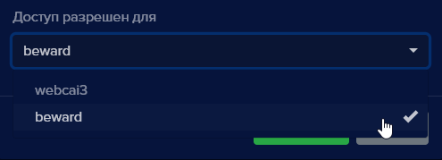

*   Сохраните настройки.

26.
**Как подключить вебкамеру?**
В **eVision **для Windows доступно использование одной веб-камеры. Для того, чтобы использовать веб камеру:

*   Подключите веб-камеру к компьютеру, с установленным **eVision**. При необходимости установите драйвера для веб-камеры.
*   Откройте **eVision**, нажмите кнопку **Добавить устройство **

>>>>>  gd2md-html alert: inline image link here (to images/image248.png). Store image on your image server and adjust path/filename/extension if necessary.  (<a href="#">Back to top</a>)(<a href="#gdcalert259">Next alert</a>) >>>>> 

.
*   В списке **Устройство** выберите пункт **Веб-камера.**

>>>>>  gd2md-html alert: inline image link here (to images/image249.png). Store image on your image server and adjust path/filename/extension if necessary.  (<a href="#">Back to top</a>)(<a href="#gdcalert260">Next alert</a>) >>>>> 

*   В появившемся поле **Имя устройства** введите наименование для устройства.

>>>>>  gd2md-html alert: inline image link here (to images/image250.png). Store image on your image server and adjust path/filename/extension if necessary.  (<a href="#">Back to top</a>)(<a href="#gdcalert261">Next alert</a>) >>>>> 

*   Нажмите кнопку **Добавить**

Откроется трансляция с веб-камеры:

>>>>>  gd2md-html alert: inline image link here (to images/image251.png). Store image on your image server and adjust path/filename/extension if necessary.  (<a href="#">Back to top</a>)(<a href="#gdcalert262">Next alert</a>) >>>>> 

27.
**Как деактивировать устройство?**
Чтобы временно отключить (деактивировать) устройство в **eVision**:

*   Добавьте устройство в **eVision**.
*   Нажмите на номер устройства на панели устройств

>>>>>  gd2md-html alert: inline image link here (to images/image252.png). Store image on your image server and adjust path/filename/extension if necessary.  (<a href="#">Back to top</a>)(<a href="#gdcalert263">Next alert</a>) >>>>> 

*   Откройте **Настройки **

>>>>>  gd2md-html alert: inline image link here (to images/image253.png). Store image on your image server and adjust path/filename/extension if necessary.  (<a href="#">Back to top</a>)(<a href="#gdcalert264">Next alert</a>) >>>>> 

, найдите раздел **Камера **

>>>>>  gd2md-html alert: inline image link here (to images/image254.png). Store image on your image server and adjust path/filename/extension if necessary.  (<a href="#">Back to top</a>)(<a href="#gdcalert265">Next alert</a>) >>>>> 

**, **нажмите переключатель **Активация **

>>>>>  gd2md-html alert: inline image link here (to images/image255.png). Store image on your image server and adjust path/filename/extension if necessary.  (<a href="#">Back to top</a>)(<a href="#gdcalert266">Next alert</a>) >>>>> 

*   Нажмите кнопку **Сохранить **

>>>>>  gd2md-html alert: inline image link here (to images/image256.png). Store image on your image server and adjust path/filename/extension if necessary.  (<a href="#">Back to top</a>)(<a href="#gdcalert267">Next alert</a>) >>>>> 

, появится уведомление:

>>>>>  gd2md-html alert: inline image link here (to images/image257.png). Store image on your image server and adjust path/filename/extension if necessary.  (<a href="#">Back to top</a>)(<a href="#gdcalert268">Next alert</a>) >>>>> 

*   Нажмите кнопку **Да**. В окне трансляции видеопотока устройства появится сообщение:

>>>>>  gd2md-html alert: inline image link here (to images/image258.png). Store image on your image server and adjust path/filename/extension if necessary.  (<a href="#">Back to top</a>)(<a href="#gdcalert269">Next alert</a>) >>>>> 

**! **Видеоаналитика будет недоступна, на этом устройстве.

28.
**Как переименовать устройство?**
Название устройству задается при его добавлении. Добавление устройства описано в пункте

>>>>>  gd2md-html alert: undefined internal link (link text: "Добавление устройства"). Did you generate a TOC?  (<a href="#">Back to top</a>)(<a href="#gdcalert270">Next alert</a>) >>>>> 

[Добавление устройства](#heading=h.b6jhxxtq5fpf). Для изменения названия устройства:

*   Откройте **Настройки **

>>>>>  gd2md-html alert: inline image link here (to images/image259.png). Store image on your image server and adjust path/filename/extension if necessary.  (<a href="#">Back to top</a>)(<a href="#gdcalert271">Next alert</a>) >>>>> 

**, **найдите раздел **Камера **

>>>>>  gd2md-html alert: inline image link here (to images/image260.png). Store image on your image server and adjust path/filename/extension if necessary.  (<a href="#">Back to top</a>)(<a href="#gdcalert272">Next alert</a>) >>>>> 

.
*   В поле **Название **введите новое название устройства:

>>>>>  gd2md-html alert: inline image link here (to images/image261.png). Store image on your image server and adjust path/filename/extension if necessary.  (<a href="#">Back to top</a>)(<a href="#gdcalert273">Next alert</a>) >>>>> 

*   Нажмите кнопку **Сохранить **

>>>>>  gd2md-html alert: inline image link here (to images/image262.png). Store image on your image server and adjust path/filename/extension if necessary.  (<a href="#">Back to top</a>)(<a href="#gdcalert274">Next alert</a>) >>>>> 

, появится уведомление:
*

>>>>>  gd2md-html alert: inline image link here (to images/image263.png). Store image on your image server and adjust path/filename/extension if necessary.  (<a href="#">Back to top</a>)(<a href="#gdcalert275">Next alert</a>) >>>>> 

*   Нажмите кнопку **Да**.
*   Откройте **Настройки **

>>>>>  gd2md-html alert: inline image link here (to images/image264.png). Store image on your image server and adjust path/filename/extension if necessary.  (<a href="#">Back to top</a>)(<a href="#gdcalert276">Next alert</a>) >>>>> 

**, **найдите раздел **Камера **

>>>>>  gd2md-html alert: inline image link here (to images/image265.png). Store image on your image server and adjust path/filename/extension if necessary.  (<a href="#">Back to top</a>)(<a href="#gdcalert277">Next alert</a>) >>>>> 

.
*   В поле **Название **будет указано новое название устройства.

29.
**Как работает встроенная лицензия на одно устройство?**
Встроенная лицензия доступна в **eVision** на одно первое устройство. Встроенная лицензия активируется автоматически при добавлении первого устройства в **eVision**. Если удалить устройство со встроенной лицензией, то при добавлении следующего устройства встроенная лицензия автоматически применится на новое устройство.

>>>>>  gd2md-html alert: inline image link here (to images/image266.png). Store image on your image server and adjust path/filename/extension if necessary.  (<a href="#">Back to top</a>)(<a href="#gdcalert278">Next alert</a>) >>>>> 

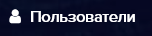

<table>
  <tr>
   <td>Операционная система
   </td>
   <td>Срок действия встроенной лицензии на одно устройство
   </td>
  </tr>
  <tr>
   <td>Windows
   </td>
   <td>365 дней
   </td>
  </tr>
  <tr>
   <td>Ubuntu
   </td>
   <td>14 дней
   </td>
  </tr>
</table>

30.
**Как активировать лицензию и включи**ть видеоаналитику**?**
Для того, чтобы активировать лицензию:

*   Добавьте устройство в **eVision**.
*   Нажмите на номер устройства на панели устройств

>>>>>  gd2md-html alert: inline image link here (to images/image267.png). Store image on your image server and adjust path/filename/extension if necessary.  (<a href="#">Back to top</a>)(<a href="#gdcalert279">Next alert</a>) >>>>> 

, откроется видеопоток выбранного устройства
*   Откройте вкладку **Настройки **

>>>>>  gd2md-html alert: inline image link here (to images/image268.png). Store image on your image server and adjust path/filename/extension if necessary.  (<a href="#">Back to top</a>)(<a href="#gdcalert280">Next alert</a>) >>>>> 

, найдите блок настроек **Лицензия**
*   Введите лицензионный ключ в поле **Лицензионный ключ**.

>>>>>  gd2md-html alert: inline image link here (to images/image269.png). Store image on your image server and adjust path/filename/extension if necessary.  (<a href="#">Back to top</a>)(<a href="#gdcalert281">Next alert</a>) >>>>> 

*   Нажмите кнопку **Сохранить **

>>>>>  gd2md-html alert: inline image link here (to images/image270.png). Store image on your image server and adjust path/filename/extension if necessary.  (<a href="#">Back to top</a>)(<a href="#gdcalert282">Next alert</a>) >>>>> 

, появится уведомление:
*

>>>>>  gd2md-html alert: inline image link here (to images/image271.png). Store image on your image server and adjust path/filename/extension if necessary.  (<a href="#">Back to top</a>)(<a href="#gdcalert283">Next alert</a>) >>>>> 

*   Нажмите кнопку **Да**.
*   Откройте **Настройки **

>>>>>  gd2md-html alert: inline image link here (to images/image272.png). Store image on your image server and adjust path/filename/extension if necessary.  (<a href="#">Back to top</a>)(<a href="#gdcalert284">Next alert</a>) >>>>> 

**, **найдите пункт **Видеоаналитика**:
*   Нажмите на один или несколько переключателей **Распознавание лиц, Распознавание персон, Распознавание автотранспорта**.

>>>>>  gd2md-html alert: inline image link here (to images/image273.png). Store image on your image server and adjust path/filename/extension if necessary.  (<a href="#">Back to top</a>)(<a href="#gdcalert285">Next alert</a>) >>>>> 

*   Нажмите кнопку **Сохранить **

>>>>>  gd2md-html alert: inline image link here (to images/image274.png). Store image on your image server and adjust path/filename/extension if necessary.  (<a href="#">Back to top</a>)(<a href="#gdcalert286">Next alert</a>) >>>>> 

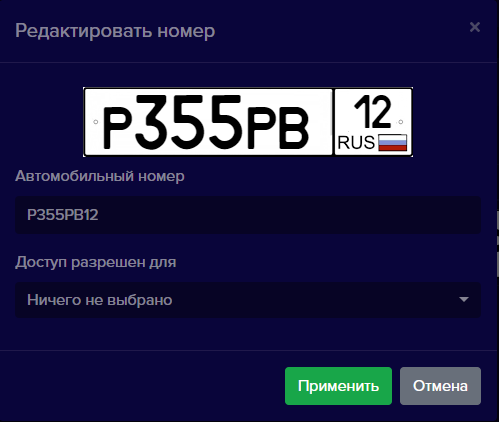
, появится уведомление:
*

>>>>>  gd2md-html alert: inline image link here (to images/image275.png). Store image on your image server and adjust path/filename/extension if necessary.  (<a href="#">Back to top</a>)(<a href="#gdcalert287">Next alert</a>) >>>>> 

*   Нажмите кнопку **Да**.

Окно подтверждения настроек закроется. В настройках устройства, в поле **Активационный ключ **автоматически появится комбинация активационного ключа:

>>>>>  gd2md-html alert: inline image link here (to images/image276.png). Store image on your image server and adjust path/filename/extension if necessary.  (<a href="#">Back to top</a>)(<a href="#gdcalert288">Next alert</a>) >>>>> 

**! **Комбинация активационного ключа генерируется через интернет. В случае отсутствия доступа в интернет на компьютере можно получить активационный ключ вручную, см пункт

>>>>>  gd2md-html alert: undefined internal link (link text: "Как активировать лицензию без доступа в интернет?"). Did you generate a TOC?  (<a href="#">Back to top</a>)(<a href="#gdcalert289">Next alert</a>) >>>>> 

[Как активировать лицензию без доступа в интернет?](#heading=h.su5subj2y2a3)

*   Проверьте распознавание объектов.

**! **Сохраните лицензионный и активационный ключи, в случае их удаления или удаления устройства, восстановить пару ключей невозможно. Активационный и лицензионный ключи можно использовать на данном компьютере для одного устройства.

31.
**Как активировать лицензию без доступа в интернет?**
В случае, если на компьютере, где установлен **eVision** отсутствует доступ в интернет, существует возможность активации лицензионного ключа в режиме оффлайн. Чтобы активировать лицензионный ключ без доступа в интернет:

*   Добавьте устройство в **eVision**.
*   Выберите устройство, нажмите на его номер на панели устройств

>>>>>  gd2md-html alert: inline image link here (to images/image277.png). Store image on your image server and adjust path/filename/extension if necessary.  (<a href="#">Back to top</a>)(<a href="#gdcalert290">Next alert</a>) >>>>> 

, откроется видеопоток выбранного устройства
*   Откройте вкладку **Настройки **

>>>>>  gd2md-html alert: inline image link here (to images/image278.png). Store image on your image server and adjust path/filename/extension if necessary.  (<a href="#">Back to top</a>)(<a href="#gdcalert291">Next alert</a>) >>>>> 

, найдите блок настроек **Лицензия**
*   Введите лицензионный ключ в поле **Лицензионный ключ**.

>>>>>  gd2md-html alert: inline image link here (to images/image279.png). Store image on your image server and adjust path/filename/extension if necessary.  (<a href="#">Back to top</a>)(<a href="#gdcalert292">Next alert</a>) >>>>> 

*   Нажмите кнопку **Сохранить **

>>>>>  gd2md-html alert: inline image link here (to images/image280.png). Store image on your image server and adjust path/filename/extension if necessary.  (<a href="#">Back to top</a>)(<a href="#gdcalert293">Next alert</a>) >>>>> 

, появится уведомление:
*

>>>>>  gd2md-html alert: inline image link here (to images/image281.png). Store image on your image server and adjust path/filename/extension if necessary.  (<a href="#">Back to top</a>)(<a href="#gdcalert294">Next alert</a>) >>>>> 

*   Нажмите кнопку **Да**.

Окно подтверждения настроек закроется.

*   Откройте **Настройки **

>>>>>  gd2md-html alert: inline image link here (to images/image282.png). Store image on your image server and adjust path/filename/extension if necessary.  (<a href="#">Back to top</a>)(<a href="#gdcalert295">Next alert</a>) >>>>> 

**, **найдите пункт **Видеоаналитика**:
*   Нажмите на переключатель одни или несколько переключателей **Распознавание лиц, Распознавание персон, Распознавание автотранспорта**.

>>>>>  gd2md-html alert: inline image link here (to images/image283.png). Store image on your image server and adjust path/filename/extension if necessary.  (<a href="#">Back to top</a>)(<a href="#gdcalert296">Next alert</a>) >>>>> 

*   Нажмите кнопку **Сохранить **

>>>>>  gd2md-html alert: inline image link here (to images/image284.png). Store image on your image server and adjust path/filename/extension if necessary.  (<a href="#">Back to top</a>)(<a href="#gdcalert297">Next alert</a>) >>>>> 

, появится окно **Информация**.

    Будет указан адрес сайта для активации лицензионного ключа. А также код активации, который нужно скопировать. Не закрывайте окно **Информация**.

>>>>>  gd2md-html alert: inline image link here (to images/image285.png). Store image on your image server and adjust path/filename/extension if necessary.  (<a href="#">Back to top</a>)(<a href="#gdcalert298">Next alert</a>) >>>>> 

*   Перейдите по ссылке на компьютере с доступом в интернет: [https://evision.tech/control/activation/](https://evision.tech/control/activation/), откроется страница **Активация Лицензионного ключа**:

>>>>>  gd2md-html alert: inline image link here (to images/image286.png). Store image on your image server and adjust path/filename/extension if necessary.  (<a href="#">Back to top</a>)(<a href="#gdcalert299">Next alert</a>) >>>>> 

*   В поле **Выберите версию приложения** выберите пункт **3.0 и выше**:** **

>>>>>  gd2md-html alert: inline image link here (to images/image287.png). Store image on your image server and adjust path/filename/extension if necessary.  (<a href="#">Back to top</a>)(<a href="#gdcalert300">Next alert</a>) >>>>> 

*   В поле **Запрос на активацию **вставьте текст из окна **Информация**:

>>>>>  gd2md-html alert: inline image link here (to images/image288.png). Store image on your image server and adjust path/filename/extension if necessary.  (<a href="#">Back to top</a>)(<a href="#gdcalert301">Next alert</a>) >>>>> 

Кнопка **Отправить** будет подсвечена красным.

*   Нажмите кнопку **Отправить **

>>>>>  gd2md-html alert: inline image link here (to images/image289.png). Store image on your image server and adjust path/filename/extension if necessary.  (<a href="#">Back to top</a>)(<a href="#gdcalert302">Next alert</a>) >>>>> 

В поле **Активационный ключ** появится активационный ключ:

>>>>>  gd2md-html alert: inline image link here (to images/image290.png). Store image on your image server and adjust path/filename/extension if necessary.  (<a href="#">Back to top</a>)(<a href="#gdcalert303">Next alert</a>) >>>>> 

*   Скопируйте активационный ключ, перенесите его в **eVision**, и в окне **Информация** введите ключ в поле: **Введите активационный ключ**:

>>>>>  gd2md-html alert: inline image link here (to images/image291.png). Store image on your image server and adjust path/filename/extension if necessary.  (<a href="#">Back to top</a>)(<a href="#gdcalert304">Next alert</a>) >>>>> 

*   Нажмите кнопку **Применить **

>>>>>  gd2md-html alert: inline image link here (to images/image292.png). Store image on your image server and adjust path/filename/extension if necessary.  (<a href="#">Back to top</a>)(<a href="#gdcalert305">Next alert</a>) >>>>> 

, окно **Информация **закроется.
*   Откройте вкладку **Настройки**, найдите раздел **Видеоаналитика**:
*   Нажмите на переключатель **Распознавание лиц, Распознавание персон, Распознавание автотранспорта**.

>>>>>  gd2md-html alert: inline image link here (to images/image293.png). Store image on your image server and adjust path/filename/extension if necessary.  (<a href="#">Back to top</a>)(<a href="#gdcalert306">Next alert</a>) >>>>> 

*   Нажмите кнопку **Сохранить **

>>>>>  gd2md-html alert: inline image link here (to images/image294.png). Store image on your image server and adjust path/filename/extension if necessary.  (<a href="#">Back to top</a>)(<a href="#gdcalert307">Next alert</a>) >>>>> 

, появится уведомление:

>>>>>  gd2md-html alert: inline image link here (to images/image295.png). Store image on your image server and adjust path/filename/extension if necessary.  (<a href="#">Back to top</a>)(<a href="#gdcalert308">Next alert</a>) >>>>> 

*   Нажмите кнопку **Да**.

Окно подтверждения настроек закроется..

32.
**Как перенести лицензию с одного устройства на другое?**
Один лицензионный ключ может работать только на одном устройстве. При необходимости лицензию можно перенести на другое устройство.

*   Откройте настройки устройства, на котором нужно использовать лицензионный ключ:

>>>>>  gd2md-html alert: inline image link here (to images/image296.png). Store image on your image server and adjust path/filename/extension if necessary.  (<a href="#">Back to top</a>)(<a href="#gdcalert309">Next alert</a>) >>>>> 

*   Введите лицензионный и активационный ключ, с другого устройства.

>>>>>  gd2md-html alert: inline image link here (to images/image297.png). Store image on your image server and adjust path/filename/extension if necessary.  (<a href="#">Back to top</a>)(<a href="#gdcalert310">Next alert</a>) >>>>> 

*   Нажмите кнопку **Сохранить **

>>>>>  gd2md-html alert: inline image link here (to images/image298.png). Store image on your image server and adjust path/filename/extension if necessary.  (<a href="#">Back to top</a>)(<a href="#gdcalert311">Next alert</a>) >>>>> 

, появится уведомление:
*

>>>>>  gd2md-html alert: inline image link here (to images/image299.png). Store image on your image server and adjust path/filename/extension if necessary.  (<a href="#">Back to top</a>)(<a href="#gdcalert312">Next alert</a>) >>>>> 

*   Нажмите кнопку **Да**.
*   Откройте **Настройки **

>>>>>  gd2md-html alert: inline image link here (to images/image300.png). Store image on your image server and adjust path/filename/extension if necessary.  (<a href="#">Back to top</a>)(<a href="#gdcalert313">Next alert</a>) >>>>> 

**, **найдите пункт **Видеоаналитика**:
*   Нажмите на переключатель **Распознавание лиц, Распознавание персон, Распознавание автотранспорта**.

>>>>>  gd2md-html alert: inline image link here (to images/image301.png). Store image on your image server and adjust path/filename/extension if necessary.  (<a href="#">Back to top</a>)(<a href="#gdcalert314">Next alert</a>) >>>>> 

*   Нажмите кнопку **Сохранить **

>>>>>  gd2md-html alert: inline image link here (to images/image302.png). Store image on your image server and adjust path/filename/extension if necessary.  (<a href="#">Back to top</a>)(<a href="#gdcalert315">Next alert</a>) >>>>> 

, появится уведомление:
*

>>>>>  gd2md-html alert: inline image link here (to images/image303.png). Store image on your image server and adjust path/filename/extension if necessary.  (<a href="#">Back to top</a>)(<a href="#gdcalert316">Next alert</a>) >>>>> 

*   Нажмите кнопку **Да**..

Окно подтверждения настроек закроется. Откроется информационное окно, с наименованием устройства, на котором в данный момент используется лицензионный ключ и включена видеоаналитика.

>>>>>  gd2md-html alert: inline image link here (to images/image304.png). Store image on your image server and adjust path/filename/extension if necessary.  (<a href="#">Back to top</a>)(<a href="#gdcalert317">Next alert</a>) >>>>> 

*   Нажмите кнопку **ОК**.

Окно подтверждения настроек закроется. Рядом с номером устройства появится индикатор видеоаналитики

>>>>>  gd2md-html alert: inline image link here (to images/image305.png). Store image on your image server and adjust path/filename/extension if necessary.  (<a href="#">Back to top</a>)(<a href="#gdcalert318">Next alert</a>) >>>>> 

.

33.
**Как выбрать режим видеоаналитики?**
Режим видеоаналитики выбирается при добавлении устройства и в настройках устройства.

*   при добавлении устройства:

>>>>>  gd2md-html alert: inline image link here (to images/image306.png). Store image on your image server and adjust path/filename/extension if necessary.  (<a href="#">Back to top</a>)(<a href="#gdcalert319">Next alert</a>) >>>>> 

*   в настройках этого устройства:

>>>>>  gd2md-html alert: inline image link here (to images/image307.png). Store image on your image server and adjust path/filename/extension if necessary.  (<a href="#">Back to top</a>)(<a href="#gdcalert320">Next alert</a>) >>>>> 

34.
**Как проверить видеоаналитику?**
Когда добавлено устройство, введен лицензионный ключ и включена видеоаналитика, можно проверить распознавание объектов. По-умолчанию, при добавлении устройства выбирается режим **Лицо**.

    46.
**Распознавание лиц**
Когда человек появляется в зоне распознавания, на видеопотоке при распознавании появляется цветная рамка с именем или идентификатором пользователя:

>>>>>  gd2md-html alert: inline image link here (to images/image308.png). Store image on your image server and adjust path/filename/extension if necessary.  (<a href="#">Back to top</a>)(<a href="#gdcalert321">Next alert</a>) >>>>> 

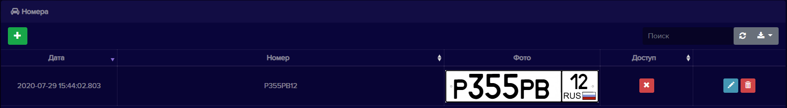

    47.
**Распознавание автомобильных номеров**
Когда автомобильный номер машины появляется в зоне распознавания, на видеопотоке при распознавании появляется цветная рамка с идентификатором номера:

>>>>>  gd2md-html alert: inline image link here (to images/image309.png). Store image on your image server and adjust path/filename/extension if necessary.  (<a href="#">Back to top</a>)(<a href="#gdcalert322">Next alert</a>) >>>>> 

35.
Как включить авто добавление пользователей?
В **eVision** существует возможность собрать базу пользователей автоматически. Это можно применять в начале использования **eVision**, если еще нет качественных фотографий пользователей.

Авто добавление пользователей позволяет добавляться их при распознавании лиц. После того, как все необходимые пользователи добавлены, автодобавление необходимо отключить. Добавленных пользователей необходимо отредактировать, ввести имена и фамилии, при необходимости выбрать группу, указать идентификатор и включить или выключить доступ на устройство.

Для того, чтобы автодобавление работало, необходимо:

36. Добавить устройство (см. пункт

>>>>>  gd2md-html alert: undefined internal link (link text: "Добавление устройства"). Did you generate a TOC?  (<a href="#">Back to top</a>)(<a href="#gdcalert323">Next alert</a>) >>>>> 

[Добавление устройства](#heading=h.b6jhxxtq5fpf))
37. Ввести лицензионный ключ или использовать встроенную лицензию (см. пункт

>>>>>  gd2md-html alert: undefined internal link (link text: "Как активировать лицензию"). Did you generate a TOC?  (<a href="#">Back to top</a>)(<a href="#gdcalert324">Next alert</a>) >>>>> 

[Как активировать лицензию](#heading=h.sp1jtzprlj88))
38. Включить видеоаналитику (см. пункт

>>>>>  gd2md-html alert: undefined internal link (link text: "Как активировать лицензию и включить видеоаналитику"). Did you generate a TOC?  (<a href="#">Back to top</a>)(<a href="#gdcalert325">Next alert</a>) >>>>> 

[Как активировать лицензию и включить видеоаналитику](#heading=h.sp1jtzprlj88))
39. Включить авто добавление пользователей

Для того, чтобы включить авто добавление пользователей:

*   Выберите устройство, нажмите на его номер на панели устройств

>>>>>  gd2md-html alert: inline image link here (to images/image310.png). Store image on your image server and adjust path/filename/extension if necessary.  (<a href="#">Back to top</a>)(<a href="#gdcalert326">Next alert</a>) >>>>> 

, откроется видеопоток выбранного устройства
*   Откройте **Настройки **

>>>>>  gd2md-html alert: inline image link here (to images/image311.png). Store image on your image server and adjust path/filename/extension if necessary.  (<a href="#">Back to top</a>)(<a href="#gdcalert327">Next alert</a>) >>>>> 

**, **найдите блок **Видеоаналитика**:
*   Проверьте, что переключатель **Распознавание лиц  **включено.

>>>>>  gd2md-html alert: inline image link here (to images/image312.png). Store image on your image server and adjust path/filename/extension if necessary.  (<a href="#">Back to top</a>)(<a href="#gdcalert328">Next alert</a>) >>>>> 

*   Найдите пункт **Автодобавление не распознанных лиц**

>>>>>  gd2md-html alert: inline image link here (to images/image313.png). Store image on your image server and adjust path/filename/extension if necessary.  (<a href="#">Back to top</a>)(<a href="#gdcalert329">Next alert</a>) >>>>> 

*   Нажмите на переключатель **Автодобавление не распознанных лиц**.

>>>>>  gd2md-html alert: inline image link here (to images/image314.png). Store image on your image server and adjust path/filename/extension if necessary.  (<a href="#">Back to top</a>)(<a href="#gdcalert330">Next alert</a>) >>>>> 

*   Нажмите кнопку **Сохранить **

>>>>>  gd2md-html alert: inline image link here (to images/image315.png). Store image on your image server and adjust path/filename/extension if necessary.  (<a href="#">Back to top</a>)(<a href="#gdcalert331">Next alert</a>) >>>>> 

*   Нажмите кнопку **ОК, **появится уведомление:

>>>>>  gd2md-html alert: inline image link here (to images/image316.png). Store image on your image server and adjust path/filename/extension if necessary.  (<a href="#">Back to top</a>)(<a href="#gdcalert332">Next alert</a>) >>>>> 

*   Нажмите кнопку **Да**.

Окно подтверждения настроек закроется.

*   После распознавания лиц в базе пользователей появятся новые записи:

>>>>>  gd2md-html alert: inline image link here (to images/image317.png). Store image on your image server and adjust path/filename/extension if necessary.  (<a href="#">Back to top</a>)(<a href="#gdcalert333">Next alert</a>) >>>>> 

*   Далее необходимо ввести имя пользователя, как отредактировать см. пункт

>>>>>  gd2md-html alert: undefined internal link (link text: "Редактирование пользователя"). Did you generate a TOC?  (<a href="#">Back to top</a>)(<a href="#gdcalert334">Next alert</a>) >>>>> 

[Редактирование пользователя](#heading=h.conv1l9o3mwg).

**! **Обратите внимание, что в зависимости от настроек распознавания см. пункт.

>>>>>  gd2md-html alert: undefined internal link (link text: "Настройки распознавания"). Did you generate a TOC?  (<a href="#">Back to top</a>)(<a href="#gdcalert335">Next alert</a>) >>>>> 

[Настройки распознавания](#heading=h.ulhscr8sbkd0) будет добавлено разное количество пользователей. Чем выше порог распознавания, тем больше пользователей будет автоматически добавлено. Дело в том, что большое значение имеет направление взгляда человека и его эмоции в момент распознавания. Может получится так, что один и тот-же человек будет добавлен несколько раз. Повторяющихся пользователей с некачественными фотографиями нужно удалить и оставить только одного пользователя с правильным именем и настройками доступа.

	Рекомендуем настройки точности распознавания оставить на уровне 30-40 %, в таком случае повторных авто добавленных персон будет меньше.

>>>>>  gd2md-html alert: inline image link here (to images/image318.png). Store image on your image server and adjust path/filename/extension if necessary.  (<a href="#">Back to top</a>)(<a href="#gdcalert336">Next alert</a>) >>>>> 

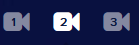

	После того, как база персон, добавленных в **eVision** будет собрана, необходимо выключить Автодобавление. Для того, чтобы выключить автодобавление:

*   Выберите устройство, нажмите на его номер на панели устройств

>>>>>  gd2md-html alert: inline image link here (to images/image319.png). Store image on your image server and adjust path/filename/extension if necessary.  (<a href="#">Back to top</a>)(<a href="#gdcalert337">Next alert</a>) >>>>> 

, откроется видеопоток выбранного устройства
*   Откройте **Настройки **

>>>>>  gd2md-html alert: inline image link here (to images/image320.png). Store image on your image server and adjust path/filename/extension if necessary.  (<a href="#">Back to top</a>)(<a href="#gdcalert338">Next alert</a>) >>>>> 

**, **найдите блок **Видеоаналитика**:
*   Включите пункт **Распознавание лиц**

>>>>>  gd2md-html alert: inline image link here (to images/image321.png). Store image on your image server and adjust path/filename/extension if necessary.  (<a href="#">Back to top</a>)(<a href="#gdcalert339">Next alert</a>) >>>>> 

*   Найдите пункт **Автодобавление не распознанных лиц**

>>>>>  gd2md-html alert: inline image link here (to images/image322.png). Store image on your image server and adjust path/filename/extension if necessary.  (<a href="#">Back to top</a>)(<a href="#gdcalert340">Next alert</a>) >>>>> 

*   Нажмите на переключатель **Автодобавление не распознанных лиц**.

>>>>>  gd2md-html alert: inline image link here (to images/image323.png). Store image on your image server and adjust path/filename/extension if necessary.  (<a href="#">Back to top</a>)(<a href="#gdcalert341">Next alert</a>) >>>>> 

*   Нажмите кнопку **Сохранить **

>>>>>  gd2md-html alert: inline image link here (to images/image324.png). Store image on your image server and adjust path/filename/extension if necessary.  (<a href="#">Back to top</a>)(<a href="#gdcalert342">Next alert</a>) >>>>> 

, появится уведомление:
*

>>>>>  gd2md-html alert: inline image link here (to images/image325.png). Store image on your image server and adjust path/filename/extension if necessary.  (<a href="#">Back to top</a>)(<a href="#gdcalert343">Next alert</a>) >>>>> 

*   Нажмите кнопку **Да**.

Окно подтверждения настроек закроется.

*   Настройки распознавания приведите к значению по умолчанию - 50%

>>>>>  gd2md-html alert: inline image link here (to images/image326.png). Store image on your image server and adjust path/filename/extension if necessary.  (<a href="#">Back to top</a>)(<a href="#gdcalert344">Next alert</a>) >>>>> 

 Автодобавление будет выключено и новые персоны добавляться не будут.

### Как включить синхронизацию для устройств Beward серии TFR ?

	Для добавления устройства Beward TFR и синхронизации базы пользователей с **eVision** нажмите на кнопку добавления устройства

>>>>>  gd2md-html alert: inline image link here (to images/image327.png). Store image on your image server and adjust path/filename/extension if necessary.  (<a href="#">Back to top</a>)(<a href="#gdcalert345">Next alert</a>) >>>>> 

, в настройках диалогового окна выберите пункт “Beward TFR”

>>>>>  gd2md-html alert: inline image link here (to images/image328.png). Store image on your image server and adjust path/filename/extension if necessary.  (<a href="#">Back to top</a>)(<a href="#gdcalert346">Next alert</a>) >>>>> 

	После добавления устройства станет доступной новая кнопка в интерфейсе раздела **Пользователи.**

>>>>>  gd2md-html alert: inline image link here (to images/image329.png). Store image on your image server and adjust path/filename/extension if necessary.  (<a href="#">Back to top</a>)(<a href="#gdcalert347">Next alert</a>) >>>>> 

	При нажатии на кнопку происходит синхронизация базы пользователей **eVision** с базой устройства Beward. По окончанию синхронизации появится сообщение “Синхронизировано устройств: 1” - синхронизация прошла успешно.

>>>>>  gd2md-html alert: inline image link here (to images/image330.png). Store image on your image server and adjust path/filename/extension if necessary.  (<a href="#">Back to top</a>)(<a href="#gdcalert348">Next alert</a>) >>>>> 

	Во время синхронизации были добавлены все пользователи из списка **eVision** в базу устройства Beward. Чтобы посмотреть список добавленных пользователей перейдите в панель управления устройством (сетевой адрес указан в инструкции к устройству).

	Авторизуйтесь на устройстве, затем перейдите в **Настройки пользователей**.

>>>>>  gd2md-html alert: inline image link here (to images/image331.png). Store image on your image server and adjust path/filename/extension if necessary.  (<a href="#">Back to top</a>)(<a href="#gdcalert349">Next alert</a>) >>>>> 

В правой части интерфейса выберите период в котором была произведена синхронизация и нажмите **Поиск**. В таблице отобразятся добавленные пользователи.

>>>>>  gd2md-html alert: inline image link here (to images/image332.png). Store image on your image server and adjust path/filename/extension if necessary.  (<a href="#">Back to top</a>)(<a href="#gdcalert350">Next alert</a>) >>>>> 

>>>>>  gd2md-html alert: inline image link here (to images/image333.png). Store image on your image server and adjust path/filename/extension if necessary.  (<a href="#">Back to top</a>)(<a href="#gdcalert351">Next alert</a>) >>>>> 

###
    Как отключить устройство Beward TFR и уведомления.

Для удаления устройства из программы вам необходимо выбрать устройство в панели **Подключенных устройств **

>>>>>  gd2md-html alert: inline image link here (to images/image334.png). Store image on your image server and adjust path/filename/extension if necessary.  (<a href="#">Back to top</a>)(<a href="#gdcalert352">Next alert</a>) >>>>> 

**,**

нажмите на кнопку удаления устройства

>>>>>  gd2md-html alert: inline image link here (to images/image335.png). Store image on your image server and adjust path/filename/extension if necessary.  (<a href="#">Back to top</a>)(<a href="#gdcalert353">Next alert</a>) >>>>> 

. Устройство удалено из системы но Beward TFR будет отсылать уведомления в систему для отключения этих уведомлений проделайте следующие шаги:

*   Откройте в браузере адрес по которому у вас в сети находится видеокамера (адрес можно узнать из инструкции к устройству, или своего системного администратора)
*   Перейдите в панель управления камерой и авторизуйтесь.
*   в главном меню панели перейдите на вкладку **Системные настройки**

>>>>>  gd2md-html alert: inline image link here (to images/image336.png). Store image on your image server and adjust path/filename/extension if necessary.  (<a href="#">Back to top</a>)(<a href="#gdcalert354">Next alert</a>) >>>>> 

*   в боковом меню выберите пункт **HTTP подписка**

>>>>>  gd2md-html alert: inline image link here (to images/image337.png). Store image on your image server and adjust path/filename/extension if necessary.  (<a href="#">Back to top</a>)(<a href="#gdcalert355">Next alert</a>) >>>>> 

*   Выберите пункты **Нет подписки **в полях **Подписка на обнаружение лиц, Подписка на незарегистрированные лица.**

>>>>>  gd2md-html alert: inline image link here (to images/image338.png). Store image on your image server and adjust path/filename/extension if necessary.  (<a href="#">Back to top</a>)(<a href="#gdcalert356">Next alert</a>) >>>>> 

>>>>>  gd2md-html alert: inline image link here (to images/image339.png). Store image on your image server and adjust path/filename/extension if necessary.  (<a href="#">Back to top</a>)(<a href="#gdcalert357">Next alert</a>) >>>>> 

*   Снимите галочку с поля **Push**

>>>>>  gd2md-html alert: inline image link here (to images/image340.png). Store image on your image server and adjust path/filename/extension if necessary.  (<a href="#">Back to top</a>)(<a href="#gdcalert358">Next alert</a>) >>>>> 

>>>>>  gd2md-html alert: inline image link here (to images/image341.png). Store image on your image server and adjust path/filename/extension if necessary.  (<a href="#">Back to top</a>)(<a href="#gdcalert359">Next alert</a>) >>>>> 

*   После того как изменения сделаны нажмите кнопку **Сохранить**, теперь панель Beward TFR не будет посылать уведомления в программу **eVision**

### Как сохранить лицензионный и активационный ключи устройства?

>>>>>  gd2md-html alert: inline image link here (to images/image342.png). Store image on your image server and adjust path/filename/extension if necessary.  (<a href="#">Back to top</a>)(<a href="#gdcalert360">Next alert</a>) >>>>> 

	Для того чтобы сохранить **Лицензионный ключ** и **Активационный ключ **необходимо проделать следующие действия:

1. В главном окне программы перейти в раздел **Настройки**.
2. В подменю выбрать раздел **Лицензия**
3. Удалите текст из полей **Лицензионный ключ** и **Активационный ключ**
4. Нажмите на клавиатуре “Enter”, либо кнопку “Сохранить” внизу страницы

>>>>>  gd2md-html alert: inline image link here (to images/image343.png). Store image on your image server and adjust path/filename/extension if necessary.  (<a href="#">Back to top</a>)(<a href="#gdcalert361">Next alert</a>) >>>>> 

5. Появится окно **Сохранить настройки, **в котором необходимо нажать кнопку **Сохранить ключи.** Появится окно с запросом сохранения файла
6.  После того как файл сохранен нажмите **Отмена ** для того чтобы не удалять ключи из программы.

### Как скопировать лицензионный и активационный ключи устройства?

>>>>>  gd2md-html alert: inline image link here (to images/image344.png). Store image on your image server and adjust path/filename/extension if necessary.  (<a href="#">Back to top</a>)(<a href="#gdcalert362">Next alert</a>) >>>>> 

	Для того что бы скопировать **Лицензионный ключ** и **Активационный ключ **необходимо проделать следующие действия:

7. В главном окне программы перейти в раздел **Настройки**.
8. В подменю выбрать раздел **Лицензия**
9. Выделить текст из поля **Лицензионный ключ**, нажать правую кнопку мыши и выбрать пункт “Копировать” (либо на клавиатуре воспользоваться сочетанием клавиш **ctrl + c**).
10. Откройте место куда вы запишите скопированный ключ (приложение текстовый редактор).
11. Поставьте курсор в место куда требуется вставить данные, нажмите правой кнопкой и в появившемся меню выберите пункт **Вставить** (либо на клавиатуре воспользуйтесь сочетанием клавиш **ctrl + v**).
12. Сохраните полученный результат.
13.  Для того чтобы скопировать **Активационный ключ **проделайте шаги с третьего по шестой.

### Как включить голосовые оповещения.

	В программе eVision вы можете включить голосовые оповещения для двух типов событий: при обнаружении в  кадре движения, и в случае обнаружения детекторами объектов (как распознанных так и не распознанных).

>>>>>  gd2md-html alert: inline image link here (to images/image345.png). Store image on your image server and adjust path/filename/extension if necessary.  (<a href="#">Back to top</a>)(<a href="#gdcalert363">Next alert</a>) >>>>> 

	Для включения оповещений вам необходимо проделать следующие шаги:

1. Перейти в **Настройки**
2. Выбрать подменю **Голосовой сервис**
3. В программе доступны два типа оповещения по движению - **Детектор движения **доступен сразу при установке в бесплатной версии \
И **Детектор объектов ** - доступен при включенном модуле **Видеоаналитика.  \
**Для включения любого из видов или совместно воспользуйтесь переключателем **Включить**. О том как включить **Видеоаналитику ** можно узнать по этой

>>>>>  gd2md-html alert: undefined internal link (link text: "ссылке"). Did you generate a TOC?  (<a href="#">Back to top</a>)(<a href="#gdcalert364">Next alert</a>) >>>>> 

[ссылке](#heading=h.n2vl2bdev4k2).

### **Как включить SIP уведомления?**

	Для использовани уведомления по SIP протоколу необходимо, чтобы устройство для распознавания поддерживало входящие вызовы по SIP без регистрации. Для примера будет использовано устройство Beward DS06A. Необходимо произвести предварительную настройку устройства Beward DS06A, для этого:

*   Откройте в браузере интерфейс Beward DS06A. По умолчанию IP адрес Beward DS06A: _192.168.0.99_
*   Перейдите в раздел **Сеть**, найдите пункт **SIP**
*   Отметьте галочкой пункт **Разрешить SIP # 1**
*   Пропишите в поля: **Имя, Номер, Имя пользователя **краткий идентификатор для sip вызова на устройство Beward DS06A.
*   В поле **Пароль** введите пароль, он может не использоваться для работы sip уведомлений, но он необходимо для безопасности.
*   В поле **SIP порт** можно прописать порт для приема SIP вызова из eVision, но этот параметр необязателен.
*   Отметьте галочкой пункт **Принимать входящие вызовы**
*   Нажмите кнопку **Сохранить**

>>>>>  gd2md-html alert: inline image link here (to images/image346.jpg). Store image on your image server and adjust path/filename/extension if necessary.  (<a href="#">Back to top</a>)(<a href="#gdcalert365">Next alert</a>) >>>>> 

 	Для включения SIP уведомлений в программе, вам необходимо:

1. Выберите устройство, нажмите на его номер на панели устройств

>>>>>  gd2md-html alert: inline image link here (to images/image347.png). Store image on your image server and adjust path/filename/extension if necessary.  (<a href="#">Back to top</a>)(<a href="#gdcalert366">Next alert</a>) >>>>> 

, откроется видеопоток выбранного устройства
2. Откройте **Настройки **

>>>>>  gd2md-html alert: inline image link here (to images/image348.png). Store image on your image server and adjust path/filename/extension if necessary.  (<a href="#">Back to top</a>)(<a href="#gdcalert367">Next alert</a>) >>>>> 

3. Найдите блок **Голосовой сервис**, найдите пункт **Настройка SIP уведомлений**

>>>>>  gd2md-html alert: inline image link here (to images/image349.png). Store image on your image server and adjust path/filename/extension if necessary.  (<a href="#">Back to top</a>)(<a href="#gdcalert368">Next alert</a>) >>>>> 

4. Переведите переключатель **Включить **в состояние включено

>>>>>  gd2md-html alert: inline image link here (to images/image350.png). Store image on your image server and adjust path/filename/extension if necessary.  (<a href="#">Back to top</a>)(<a href="#gdcalert369">Next alert</a>) >>>>> 

5. Пропишите в строке **SIP URI **строку для обращения **eVision** к устройству Beward DS06A в формате: _sip:door@172.17.2.100:5063_. Где: door - номер устройства, который был введен в настройках устройства Beward DS06A, в пункте **SIP**; 172.17.2.100 - IP адрес устройства Beward DS06A; 5063 - порт для SIP вызова, необязательный параметр.

>>>>>  gd2md-html alert: inline image link here (to images/image351.png). Store image on your image server and adjust path/filename/extension if necessary.  (<a href="#">Back to top</a>)(<a href="#gdcalert370">Next alert</a>) >>>>> 

*   Нажмите кнопку **Сохранить **

>>>>>  gd2md-html alert: inline image link here (to images/image352.png). Store image on your image server and adjust path/filename/extension if necessary.  (<a href="#">Back to top</a>)(<a href="#gdcalert371">Next alert</a>) >>>>> 

, появится уведомление:
*

>>>>>  gd2md-html alert: inline image link here (to images/image353.png). Store image on your image server and adjust path/filename/extension if necessary.  (<a href="#">Back to top</a>)(<a href="#gdcalert372">Next alert</a>) >>>>> 

*   Нажмите кнопку **Да**.

Окно подтверждения настроек закроется. Теперь SIP уведомления можно проверить.

Следует помнить, что при использовании sip уведомлений, необходимо, чтобы был настроек замок. Настройка замка описана в пункте

>>>>>  gd2md-html alert: undefined internal link (link text: "25"). Did you generate a TOC?  (<a href="#">Back to top</a>)(<a href="#gdcalert373">Next alert</a>) >>>>> 

[25](#heading=h.xl0s61bc2vfd), данного руководства.

### Как включить сервис eVision.Cloud?

>>>>>  gd2md-html alert: inline image link here (to images/image354.png). Store image on your image server and adjust path/filename/extension if necessary.  (<a href="#">Back to top</a>)(<a href="#gdcalert374">Next alert</a>) >>>>> 

Для того чтобы включить сервис** eVision Cloud** перейдите в **Настройки**,  далее в **Подключение к eVision Cloud **и затем нажмите **Активировать**

Для того чтобы использовать **eVision Cloud**  необходимо зарегистрироваться в системе [TrustedID](https://trusted.plus/id/). После нажатия на **Зарегистрировать устройство, **откроется окно с авторизацией на портале.

>>>>>  gd2md-html alert: inline image link here (to images/image355.png). Store image on your image server and adjust path/filename/extension if necessary.  (<a href="#">Back to top</a>)(<a href="#gdcalert375">Next alert</a>) >>>>> 

### Как поменять пароль Администратора?

**! **Для того чтобы сменить пароль администратора, необходимо находиться в системе под учетной записью роль Администратор.

	Для смены пароля учетной записи администратора выполните следующие действия:

1. Перейдите во вкладку **Учетные записи**
2. Выберите учетную запись по роли в системе - **Администратор**

>>>>>  gd2md-html alert: inline image link here (to images/image356.png). Store image on your image server and adjust path/filename/extension if necessary.  (<a href="#">Back to top</a>)(<a href="#gdcalert376">Next alert</a>) >>>>> 

3. Нажмите редактировать и введите новый пароль учетной записи в поле **Новый пароль**

>>>>>  gd2md-html alert: inline image link here (to images/image357.png). Store image on your image server and adjust path/filename/extension if necessary.  (<a href="#">Back to top</a>)(<a href="#gdcalert377">Next alert</a>) >>>>> 

4. Нажмите **Применить.**

### Какие права есть у пользователя группы Оператор?

	Для учетных записей группы **Оператор **доступны следующие права:

*   Просмотр видеопотока
*   Просмотр видеоархива
*   Просмотр персон
*   Просмотр номеров
*   Просмотр групп
*   Просмотр истории
*   Просмотр отчетов
*   Работа с виджетом открытых линий

### Как включить переадресацию портов?

	Для включения переадресации портов в программе **eVision** перейдите в **Настройки** программы

>>>>>  gd2md-html alert: inline image link here (to images/image358.png). Store image on your image server and adjust path/filename/extension if necessary.  (<a href="#">Back to top</a>)(<a href="#gdcalert378">Next alert</a>) >>>>> 

Выберите пункт **Переадресация портов**, раскроется меню дополнительных настроек где можно включить переадресацию портов, и указать **Внешний порт, Внешний IP**

####

>>>>>  gd2md-html alert: inline image link here (to images/image359.png). Store image on your image server and adjust path/filename/extension if necessary.  (<a href="#">Back to top</a>)(<a href="#gdcalert379">Next alert</a>) >>>>> 

### Как включить UPnP?

    Для того что бы включить UPnP (Universal Plug and Play) перейдите в **Настройки** программы.

>>>>>  gd2md-html alert: inline image link here (to images/image360.png). Store image on your image server and adjust path/filename/extension if necessary.  (<a href="#">Back to top</a>)(<a href="#gdcalert380">Next alert</a>) >>>>> 

>>>>>  gd2md-html alert: inline image link here (to images/image361.png). Store image on your image server and adjust path/filename/extension if necessary.  (<a href="#">Back to top</a>)(<a href="#gdcalert381">Next alert</a>) >>>>> 

    В окне **Изменение настроек **выберите пункт **UPnP, **откроется раскрывающееся меню где можно включить или отключить данную настройку.

### Как работает точность распознавания?

	Для того что бы настроить точность распознавания  перейдите в **Меню общих настроек**

>>>>>  gd2md-html alert: inline image link here (to images/image362.png). Store image on your image server and adjust path/filename/extension if necessary.  (<a href="#">Back to top</a>)(<a href="#gdcalert382">Next alert</a>) >>>>> 

, **Настройки **

>>>>>  gd2md-html alert: inline image link here (to images/image363.png). Store image on your image server and adjust path/filename/extension if necessary.  (<a href="#">Back to top</a>)(<a href="#gdcalert383">Next alert</a>) >>>>> 

 , и далее выберите пункт **Настройки распознавания.**

>>>>>  gd2md-html alert: inline image link here (to images/image364.png). Store image on your image server and adjust path/filename/extension if necessary.  (<a href="#">Back to top</a>)(<a href="#gdcalert384">Next alert</a>) >>>>> 

	Параметр **Минимальная точность распознавания ** позволяет настроить порог при котором программа будет считать что распознанное лицо или автомобильный номер совпадают с имеющимися в базе.

### Как работает экспорт и импорт?

	В программе **eVision **доступны следующие виды экспорта/импорта:

*   Настройки - общие настройки программы
*   Устройства - имеющиеся в программе устройства и их настройки.
*   База данных учетных записей
*   База данных пользователей
*   База данных автомобильных номеров

>>>>>  gd2md-html alert: inline image link here (to images/image365.png). Store image on your image server and adjust path/filename/extension if necessary.  (<a href="#">Back to top</a>)(<a href="#gdcalert385">Next alert</a>) >>>>> 

	Экспорт и импорт настроек происходит в формате **JSON** и упаковывается при экспорте в формате **ZIP.**

## **Диагностика неполадок (если нужно)**

**Не работает распознавание объектов**

**Не звучат SIP уведомления**

**Нет индикатора SIP уведомления в истории**

## **Часто встречающиеся ошибки**

<table>
  <tr>
   <td><strong>Ошибка</strong>
   </td>
   <td><strong>Описание ошибки</strong>
   </td>
   <td><strong>Требуемые действия пользователя при возникновении ошибки</strong>
   </td>
  </tr>
  <tr>
   <td>Введенная пара логин/пароль неверна.

Осталось попыток: 2
   </td>
   <td>Неверно введен логин и/или пароль
   </td>
   <td>Убедиться, что CapsLock  выключен и установлен правильный регистр.

Повторно ввести пару логин/пароль
   </td>
  </tr>
  <tr>
   <td>Вы истратили все попытки для входа!

Следующая попытка будет доступна: &lt;.дата/время..>
   </td>
   <td>Трижды неверно введен логин и/или пароль
   </td>
   <td>Ввести пару логин/пароль после указанного времени, убедившись в их корректности
   </td>
  </tr>
</table>

### Общие настройки

<table>
  <tr>
   <td><strong>Ошибка</strong>
   </td>
   <td><strong>Описание ошибки</strong>
   </td>
   <td><strong>Требуемые действия пользователя при возникновении ошибки</strong>
   </td>
  </tr>
  <tr>
   <td>Новый пароль и его подтверждение не совпадают!
   </td>
   <td>При смене пароля новый пароль не соответствует подтверждению
   </td>
   <td>Повторно ввести новый пароль и подтверждение
   </td>
  </tr>
  <tr>
   <td>Один или несколько параметров введены неверно!
   </td>
   <td>Вместо значений времени для хранения истории и/или видеоархива

введены пробелы
   </td>
   <td>Установить числовые значения времени хранения:
<ul>

<li>для видеоархива - 1-30

<li>для истории - 1-366
</li>
</ul>
   </td>
  </tr>
  <tr>
   <td>Импортирова-

ние не удалось! Некорректный формат импортируемых данных!
   </td>
   <td rowspan="2" >Неверные форматы файла-архива и/или данных в нем
   </td>
   <td rowspan="2" >Указать правильное местоположение файла для импорта; поскольку файл был ранее сформирован в правильном формате командой экспорта
   </td>
  </tr>
  <tr>
   <td>Импортирова-

ние не удалось! Неподдерживаемый формат архива!
   </td>
  </tr>
</table>

### Добавление устройств

<table>
  <tr>
   <td><strong>Ошибка</strong>
   </td>
   <td><strong>Описание ошибки</strong>
   </td>
   <td><strong>Требуемые действия пользователя при возникновении ошибки</strong>
   </td>
  </tr>
  <tr>
   <td>Недостаточно свободных ресурсов для добавления устройства!
   </td>
   <td>Процессор и/или оперативная память загружены более чем на 90 %
   </td>
   <td>
<ol>

<li>Освободить часть ресурсов компьютера (закрыть часть приложений и/или удалить неиспользуемые устройства)

<li>Повторно попытаться подключить устройство
</li>
</ol>
   </td>
  </tr>
  <tr>
   <td>Введен некорректный IP-адрес устройства!
   </td>
   <td>IP-адрес не соответст-

вует шаблону  или отсутствует в системе
   </td>
   <td>Ввести валидный IP-адрес устройства.

При необходимости уточнить у системного администратора
   </td>
  </tr>
</table>

### База Пользователи

<table>
  <tr>
   <td><strong>Ошибка</strong>
   </td>
   <td><strong>Описание ошибки</strong>
   </td>
   <td><strong>Требуемые действия пользователя при возникновении ошибки</strong>
   </td>
  </tr>
  <tr>
   <td>Необходимо выбрать роль!
   </td>
   <td>Не указана роль пользователя
   </td>
   <td>Выбрать роль для пользователя из списка <em>Администратор/Пользователь</em>
   </td>
  </tr>
  <tr>
   <td>Необходимо ввести логин!
   </td>
   <td>Не указан логин пользователя
   </td>
   <td>Задать уникальный логин для пользователя
   </td>
  </tr>
  <tr>
   <td>Пользователь {{user}}  уже существует!
   </td>
   <td>Повторное задание логина пользователя
   </td>
   <td>Задать уникальный логин для пользователя

либо

отменить операцию
   </td>
  </tr>
</table>

### База Пользователей

<table>
  <tr>
   <td><strong>Ошибка</strong>
   </td>
   <td><strong>Описание ошибки</strong>
   </td>
   <td><strong>Требуемые действия пользователя при возникновении ошибки</strong>
   </td>
  </tr>
  <tr>
   <td>Необходимо ввести имя пользователя!
   </td>
   <td>В операции добавления не введено имя
   </td>
   <td>Указать имя пользователя (идентификатор)

либо

отменить операцию
   </td>
  </tr>
  <tr>
   <td>Пользователь {{user}} уже существует!
   </td>
   <td>Повторное задание уже имеющегося логина пользователя
   </td>
   <td>Сделать имя (идентификатор) нового пользователя уникальным.

Рекомендуется создать стандартизованную систему обозначений для повторяющихся идентификаторов
   </td>
  </tr>
  <tr>
   <td>Необходимо добавить фото пользователя!
   </td>
   <td>При добавлении нового пользователя не выбран файл фотографии лица
   </td>
   <td>Указать местоположение файла фотографии лица нового пользователя
   </td>
  </tr>
  <tr>
   <td>Лицо не найдено!
   </td>
   <td>На выбранном файле изображения система не нашла лицо
   </td>
   <td>Заменить файл.
   </td>
  </tr>
  <tr>
   <td>Найдено более чем одно лицо!
   </td>
   <td>На выбранном файле изображения система нашла более одного лица
   </td>
   <td>Заменить файл.
   </td>
  </tr>
  <tr>
   <td>Необходимо добавить архив пользователей!
   </td>
   <td>При добавлении группы новых пользователей не выбран файл архива фотографий лиц
   </td>
   <td>Указать местоположение файла-архива фотографий лиц новых пользователей
   </td>
  </tr>
  <tr>
   <td>Добавление множества пользователей не удалось! Неподдерживаемый формат архива!
   </td>
   <td>Формат файла-архива фотографий отличен от *.zip
   </td>
   <td>Заменить файл.

При необходимости создать новый файл-архив в формате *.zip
   </td>
  </tr>
  <tr>
   <td>Добавление множества пользователей не удалось! Неподдерживаемый формат изображений в архиве!
   </td>
   <td>Файл-архив не содержит изображений в требуемом формате
   </td>
   <td>Заменить файл.

При необходимости создать новый zip-архив с изображениями в формате jpg (jpeg)
   </td>
  </tr>
  <tr>
   <td>Не удалось получить данные!
   </td>
   <td>Попытка загрузить слишком большой файл-архив
   </td>
   <td>Разбить большой файл на несколько архивов меньшего размера и загружать их по очереди
   </td>
  </tr>
</table>

### База Групп

<table>
  <tr>
   <td><strong>Ошибка</strong>
   </td>
   <td><strong>Описание ошибки</strong>
   </td>
   <td><strong>Требуемые действия пользователя при возникновении ошибки</strong>
   </td>
  </tr>
  <tr>
   <td>Необходимо ввести название группы!
   </td>
   <td>Не указан логин группы
   </td>
   <td>Задать уникальный логин для группы
   </td>
  </tr>
  <tr>
   <td>Группа {{group}}  уже существует!
   </td>
   <td>Повторное задание уже имеющегося логина группы
   </td>
   <td>Задать уникальный логин для группы либо отменить операцию
   </td>
  </tr>
</table>

### База Номера

<table>
  <tr>
   <td><strong>Ошибка</strong>
   </td>
   <td><strong>Описание ошибки</strong>
   </td>
   <td><strong>Требуемые действия пользователя при возникновении ошибки</strong>
   </td>
  </tr>
  <tr>
   <td>Необходимо ввести автомобильный номер!
   </td>
   <td>В операции добавления не введен номер
   </td>
   <td>Указать номер

ЛИБО

отменить операцию
   </td>
  </tr>
  <tr>
   <td>Введен некорректный формат автомобильного номера!
   </td>
   <td>Вводимый номер не соответствует шаблону
   </td>
   <td>Задать номер в соответствии с шаблоном российских номеров

ЛИБО

изменить шаблон (не рекомендуется)
   </td>
  </tr>
</table>

### Лицензионный ключ

<table>
  <tr>
   <td><strong>Ошибка</strong>
   </td>
   <td><strong>Описание ошибки</strong>
   </td>
   <td><strong>Требуемые действия пользователя при возникновении ошибки</strong>
   </td>
  </tr>
  <tr>
   <td>Лицензионный ключ не задан!
   </td>
   <td>При активации режима видеоаналитики не заполнено поле лицензионного ключа
   </td>
   <td>Ввести валидное значение в поле лицензионного ключа и сохранить изменение
   </td>
  </tr>
  <tr>
   <td>Лицензионный ключ не действителен!
   </td>
   <td>Задан ключ в неправильном формате
   </td>
   <td>Очистить поле ввода ключа и повторно ввести значение полученного лицензионного ключа
   </td>
  </tr>
  <tr>
   <td>Истек срок действия лицензионного ключа!
   </td>
   <td>Для продолжения работы требуется новый ключ
   </td>
   <td>Приобрести новый ключ и задать его в поле ввода лицензионного ключа
   </td>
  </tr>
  <tr>
   <td>Лицензионный ключ уже используется для камеры {{device}}
   </td>
   <td>Для каждого устройства требуется свой лицензионный ключ
   </td>
   <td>Приобрести лицензионный ключ для данного устройства

ЛИБО

перенести имеющийся ключ текущему устройству
   </td>
  </tr>
  <tr>
   <td>...
   </td>
   <td>
   </td>
   <td>
   </td>
  </tr>
</table>

## **Неактивные функции в версии eVision 3.4:**

1. Голосовые оповещения при распознавании объектов (в режиме номера)
